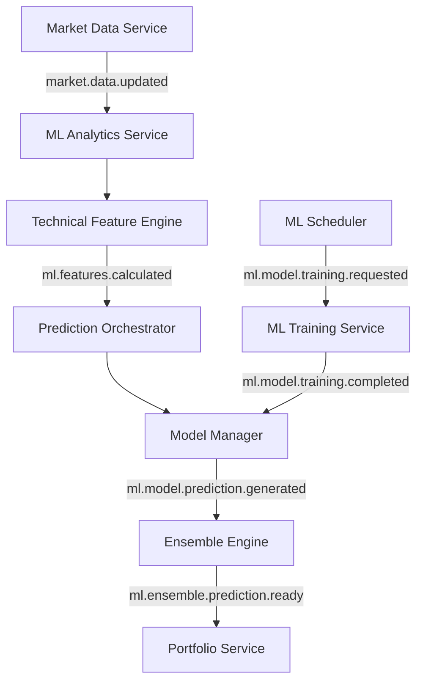

# ML-Pipeline Dokumentation v1.0.0

**Datum:** 17. August 2025  
**Autor:** Claude Code  
**Projekt:** aktienanalyse-ökosystem  
**Deployment:** 10.1.1.174

---

## 📋 Inhaltsverzeichnis

1. [Übersicht](#übersicht)
2. [Architektur](#architektur)
3. [Services](#services)
4. [Installation & Deployment](#installation--deployment)
5. [Konfiguration](#konfiguration)
6. [API-Dokumentation](#api-dokumentation)
7. [Monitoring & Wartung](#monitoring--wartung)
8. [Troubleshooting](#troubleshooting)
9. [Erweiterungen](#erweiterungen)

---

## 🎯 Übersicht

Die ML-Pipeline erweitert das bestehende aktienanalyse-ökosystem um fortgeschrittene Machine Learning-Funktionalitäten für Aktienprognosen. Das System ist vollständig event-driven und integriert sich nahtlos in die bestehende Architektur.

### **Kernfeatures:**
- **LSTM-basierte Prognosemodelle** für 4 verschiedene Zeithorizonte (7, 30, 150, 365 Tage)
- **25+ technische Indikatoren** für Feature Engineering
- **Ensemble-Predictions** mit Confidence-Scoring
- **Automatisches Model-Training** und -Deployment
- **Event-driven Architecture** für Real-time-Processing
- **PostgreSQL + TimescaleDB** für optimierte Datenspeicherung

### **Unterstützte Prognose-Horizonte:**
- **7 Tage:** Kurzfristige Trading-Signale
- **30 Tage:** Mittelfristige Trendanalyse  
- **150 Tage:** Langfristige Positionierung
- **365 Tage:** Strategische Portfolioplanung

---

## 🏗️ Architektur

### **Event-Driven ML-Pipeline:**



### **Datenfluss:**
1. **Market Data Update** triggert Feature-Berechnung
2. **Technical Features** werden extrahiert und gespeichert
3. **ML Models** generieren Individual-Predictions
4. **Ensemble Engine** kombiniert zu finaler Prognose
5. **Portfolio Service** erhält Prediction-Events

### **Service-Architektur:**
- **ML Analytics Service (Port 8019):** Haupt-Orchestrator
- **ML Training Service (Port 8020):** Dediziertes Model-Training
- **ML Scheduler:** Automatisches Training (täglich 02:00 Uhr)

---

## 🔧 Services

### **1. ML Analytics Service**

**Datei:** `ml_analytics_orchestrator_v1_0_0_20250817.py`  
**Port:** 8019  
**Funktion:** Haupt-ML-Service für Real-time-Predictions

#### **Komponenten:**
- **Technical Feature Engine:** Berechnung technischer Indikatoren
- **Model Manager:** Model-Lebenszyklus-Management
- **Prediction Orchestrator:** Ensemble-Predictions
- **Event Handler:** Integration in Event-Bus

#### **API-Endpoints:**
- `GET /health` - Service Health Check
- `GET /status` - Detaillierter Service-Status
- `GET /metrics` - Performance-Metriken
- `POST /predict/{symbol}` - Manual Prediction Request

### **2. ML Training Service**

**Datei:** `training_service_v1_0_0_20250817.py`  
**Port:** 8020  
**Funktion:** Dediziertes Model-Training

#### **Features:**
- **LSTM Training:** Multi-Horizon LSTM-Modelle
- **Performance Evaluation:** Automatische Model-Bewertung
- **Intelligent Deployment:** Deployment bei Performance-Verbesserung
- **Queue Management:** Training-Job-Queue für Batch-Processing

#### **Training-Metriken:**
- **Directional Accuracy:** Wichtigste Metrik für Trading
- **MAE (Mean Absolute Error):** Prediction-Genauigkeit
- **R² Score:** Modell-Güte
- **Sharpe Ratio:** Risk-adjusted Performance

### **3. ML Scheduler**

**Service:** `ml-scheduler.service`  
**Timer:** `ml-scheduler.timer`  
**Ausführung:** Täglich um 02:00 Uhr

#### **Funktionen:**
- **Batch Training:** Training für alle aktiven Symbole
- **Health Monitoring:** Service-Status-Überwachung
- **Event Publishing:** Training-Request-Events
- **Configurable:** Flexibel anpassbare Symbol-Listen

---

## 📦 Installation & Deployment

### **Quick Start (All-in-One):**

```bash
# Komplette ML-Pipeline in einem Befehl deployen
cd /home/mdoehler/aktienanalyse-ökosystem
./quick-start-ml-pipeline.sh
```

### **Manuelle Installation:**

#### **1. PostgreSQL ML-Schema:**
```bash
cd database
export POSTGRES_PASSWORD="aktienanalyse_2024!"
./deploy-ml-schema.sh
```

#### **2. ML Services Deployment:**
```bash
cd deployment
./deploy-ml-services.sh
```

#### **3. Service Management:**
```bash
# Services starten
sudo systemctl start ml-analytics.service
sudo systemctl start ml-training.service
sudo systemctl start ml-scheduler.timer

# Status prüfen
sudo systemctl status ml-analytics.service
```

### **Verzeichnisstruktur:**
```
/home/aktienanalyse/
├── aktienanalyse-ökosystem/
│   ├── services/ml-analytics-service-modular/
│   ├── database/migrations/
│   └── deployment/
├── ml-models/
│   ├── technical/{7d,30d,150d,365d}/
│   ├── sentiment/{7d,30d,150d,365d}/
│   └── fundamental/{7d,30d,150d,365d}/
└── logs/
```

---

## ⚙️ Konfiguration

### **Environment Variables:**

#### **Service Configuration:**
```bash
ML_SERVICE_NAME=ml-analytics
ML_SERVICE_PORT=8019
ML_SERVICE_TRAINING_PORT=8020
```

#### **Database Configuration:**
```bash
ML_DATABASE_HOST=localhost
ML_DATABASE_PORT=5432
ML_DATABASE_NAME=aktienanalyse
ML_DATABASE_USER=ml_service
ML_DATABASE_PASSWORD=ml_service_secure_2025
```

#### **Redis Configuration:**
```bash
ML_REDIS_URL=redis://localhost:6379/2
ML_EVENT_TTL_SECONDS=3600
ML_HEARTBEAT_INTERVAL=30
```

#### **Model Configuration:**
```bash
ML_MODEL_STORAGE_PATH=/home/aktienanalyse/ml-models
ML_ENABLE_GPU=false
ML_MIXED_PRECISION=false
```

#### **Training Configuration:**
```bash
ML_TRAINING_EPOCHS=50
ML_TRAINING_BATCH_SIZE=32
ML_TRAINING_LEARNING_RATE=0.001
ML_FEATURE_CACHE_TTL_HOURS=6
ML_PREDICTION_CACHE_TTL_HOURS=1
```

### **Model-Parameter:**

#### **LSTM-Architektur:**
- **Input Sequence Length:** 60 Tage
- **LSTM Units:** 128 (erste Schicht), 64 (zweite Schicht)
- **Dense Units:** 64, 32
- **Dropout Rate:** 0.3
- **Activation:** ReLU (hidden), Linear (output)

#### **Training-Parameter:**
- **Optimizer:** Adam
- **Learning Rate:** 0.001
- **Batch Size:** 32
- **Epochs:** 50 (mit Early Stopping)
- **Validation Split:** 20%

---

## 🔌 API-Dokumentation

### **ML Analytics API (Port 8019)**

#### **Health Check:**
```bash
GET http://10.1.1.174:8019/health

Response:
{
  "service_name": "ml-analytics",
  "status": "healthy",
  "uptime_seconds": 3600,
  "components": {
    "feature_engine": "healthy",
    "model_manager": "healthy",
    "prediction_orchestrator": "healthy"
  }
}
```

#### **Service Status:**
```bash
GET http://10.1.1.174:8019/status

Response:
{
  "service_info": {...},
  "active_models": 4,
  "recent_predictions": 25,
  "performance_metrics": {...}
}
```

#### **Manual Prediction:**
```bash
POST http://10.1.1.174:8019/predict/AAPL

Response:
{
  "symbol": "AAPL",
  "predictions": {
    "7d": {"value": 2.34, "confidence": 0.82},
    "30d": {"value": 5.67, "confidence": 0.75},
    "150d": {"value": 12.45, "confidence": 0.68},
    "365d": {"value": 18.90, "confidence": 0.52}
  },
  "ensemble_confidence": 0.74,
  "prediction_timestamp": "2025-08-17T14:30:00Z"
}
```

### **ML Training API (Port 8020)**

#### **Training Status:**
```bash
GET http://10.1.1.174:8020/status

Response:
{
  "is_training": false,
  "active_training_jobs": 0,
  "training_queue_size": 0,
  "total_jobs_processed": 12
}
```

#### **Manual Training:**
```bash
POST http://10.1.1.174:8020/train
Content-Type: application/json

{
  "symbol": "AAPL",
  "model_type": "technical",
  "horizon_days": 7
}

Response:
{
  "job_id": "manual_AAPL_technical_7_1692276300",
  "status": "queued",
  "estimated_duration_minutes": 15
}
```

---

## 📊 Monitoring & Wartung

### **Service Monitoring:**

#### **Service Status:**
```bash
# Service Status prüfen
sudo systemctl status ml-analytics.service
sudo systemctl status ml-training.service
sudo systemctl status ml-scheduler.timer

# Logs anzeigen
sudo journalctl -u ml-analytics.service -f
sudo journalctl -u ml-training.service -f
```

#### **Port Monitoring:**
```bash
# Listening Ports prüfen
ss -tuln | grep ":8019"  # ML Analytics
ss -tuln | grep ":8020"  # ML Training
```

### **Database Monitoring:**

#### **ML-Tabellen Status:**
```sql
-- ML-Tabellen prüfen
SELECT table_name, 
       (SELECT COUNT(*) FROM information_schema.columns WHERE table_name = t.table_name) as columns
FROM information_schema.tables t 
WHERE table_schema = 'public' AND table_name LIKE 'ml_%';

-- Recent Predictions
SELECT symbol, COUNT(*) as prediction_count, MAX(created_at) as last_prediction
FROM ml_predictions 
WHERE created_at > NOW() - INTERVAL '24 hours'
GROUP BY symbol;

-- Model Performance
SELECT model_type, horizon_days, AVG(directional_accuracy) as avg_accuracy
FROM ml_model_performance 
WHERE evaluation_date > CURRENT_DATE - 30
GROUP BY model_type, horizon_days;
```

### **Performance Metriken:**

#### **API Response Times:**
```bash
# ML Analytics Response Time
curl -w "@curl-format.txt" -s -o /dev/null http://10.1.1.174:8019/health

# Training Service Response Time  
curl -w "@curl-format.txt" -s -o /dev/null http://10.1.1.174:8020/status
```

#### **Model Storage:**
```bash
# Model Files überprüfen
find /home/aktienanalyse/ml-models -name "*.h5" -ls
find /home/aktienanalyse/ml-models -name "*.pkl" -ls

# Storage Usage
du -sh /home/aktienanalyse/ml-models/*
```

### **Automatische Wartung:**

#### **Daily Health Check:**
```bash
# Health Check Script (kann als Cron-Job ausgeführt werden)
#!/bin/bash
curl -s http://10.1.1.174:8019/health | jq '.status' | grep -q "healthy" && echo "✓ ML Analytics: OK" || echo "✗ ML Analytics: FAILED"
curl -s http://10.1.1.174:8020/status | jq '.status' | grep -q "running" && echo "✓ ML Training: OK" || echo "✗ ML Training: FAILED"
```

---

## 🔧 Troubleshooting

### **Häufige Probleme:**

#### **1. Service startet nicht:**
```bash
# Logs prüfen
sudo journalctl -u ml-analytics.service --no-pager -n 50

# Häufige Ursachen:
# - PostgreSQL nicht verfügbar
# - Redis nicht verfügbar  
# - Python Dependencies fehlen
# - Falsche Environment Variables

# Solutions:
sudo systemctl start postgresql
sudo systemctl start redis
source /home/aktienanalyse/aktienanalyse-ökosystem/venv/bin/activate
```

#### **2. Training schlägt fehl:**
```bash
# Training Logs prüfen
sudo journalctl -u ml-training.service --no-pager -n 100

# Häufige Ursachen:
# - Insufficient market data
# - Memory limit exceeded
# - TensorFlow configuration error

# Solutions:
# Check data availability:
psql -U aktienanalyse -d aktienanalyse -c "SELECT symbol, COUNT(*) FROM market_data_daily GROUP BY symbol;"

# Check memory usage:
free -h
```

#### **3. Predictions ungenau:**
```bash
# Model Performance prüfen
psql -U aktienanalyse -d aktienanalyse -c "
SELECT model_type, horizon_days, performance_metrics 
FROM ml_model_metadata 
WHERE status = 'active';
"

# Retrain Models falls Performance schlecht:
sudo systemctl start ml-scheduler.service
```

#### **4. Event-Bus Probleme:**
```bash
# Redis Status prüfen
redis-cli -u redis://localhost:6379/2 ping

# Event-Bus Monitoring:
redis-cli -u redis://localhost:6379/2 MONITOR

# Events prüfen:
redis-cli -u redis://localhost:6379/2 PUBSUB CHANNELS "events:ml:*"
```

### **Log-Analyse:**

#### **Wichtige Log-Patterns:**
```bash
# Successful Predictions
sudo journalctl -u ml-analytics.service | grep "Predictions generated"

# Training Completions
sudo journalctl -u ml-training.service | grep "Training completed"

# Error Patterns
sudo journalctl -u ml-analytics.service | grep -i "error\|failed\|exception"
```

### **Performance-Debugging:**

#### **Slow Predictions:**
```bash
# Database Query Performance
psql -U aktienanalyse -d aktienanalyse -c "
SELECT query, mean_exec_time, calls 
FROM pg_stat_statements 
WHERE query LIKE '%ml_%' 
ORDER BY mean_exec_time DESC;
"

# Feature Engine Performance
curl http://10.1.1.174:8019/metrics | jq '.feature_engine.avg_calculation_time_ms'
```

---

## 🚀 Erweiterungen

### **Geplante Features (Phase 2):**

#### **1. Sentiment Analysis:**
- **News Sentiment:** Integration von Nachrichten-Sentiment
- **Social Media:** Twitter/Reddit-Sentiment-Analyse
- **Financial Reports:** Earnings-Call-Sentiment

#### **2. Fundamental Analysis:**
- **Financial Ratios:** P/E, P/B, ROE, etc.
- **Earnings Data:** Quarterly/Annual Earnings
- **Economic Indicators:** GDP, Inflation, Interest Rates

#### **3. Enhanced Models:**
- **Transformer Models:** Attention-basierte Modelle
- **Multi-Asset Models:** Cross-Asset-Correlations
- **Risk Models:** VaR, CVaR, Maximum Drawdown

### **Performance Optimizations:**

#### **1. GPU Training:**
```bash
# GPU Support aktivieren
ML_ENABLE_GPU=true
ML_MIXED_PRECISION=true
```

#### **2. Model Caching:**
```bash
# Advanced Caching
ML_FEATURE_CACHE_TTL_HOURS=12
ML_PREDICTION_CACHE_TTL_HOURS=2
ML_MODEL_CACHE_SIZE=10
```

#### **3. Batch Processing:**
```bash
# Batch Predictions
ML_BATCH_SIZE=64
ML_MAX_CONCURRENT_TRAININGS=4
```

### **Integration-Möglichkeiten:**

#### **1. Frontend Dashboard:**
- **Real-time Predictions:** WebSocket-basierte Updates
- **Model Performance:** Interactive Charts
- **Training Status:** Live Training-Monitoring

#### **2. Portfolio Integration:**
- **Position Sizing:** ML-basierte Positionsgrößen
- **Risk Management:** Prediction-basierte Stop-Loss
- **Rebalancing:** Automated Portfolio-Rebalancing

#### **3. Alert System:**
- **Prediction Alerts:** High-Confidence-Predictions
- **Model Alerts:** Performance-Degradation-Warnings
- **System Alerts:** Service-Health-Notifications

---

## 📞 Support & Wartung

### **Wartungsplan:**

#### **Täglich:**
- Automatisches Model-Training (02:00 Uhr)
- Health-Check aller Services
- Log-Rotation und Cleanup

#### **Wöchentlich:**
- Model-Performance-Review
- Database-Maintenance
- Backup-Verification

#### **Monatlich:**
- Feature-Engineering-Optimization
- Model-Architecture-Review
- Performance-Tuning

### **Backup-Strategie:**

#### **Models:**
```bash
# Model Backup
rsync -av /home/aktienanalyse/ml-models/ /backup/ml-models/
```

#### **Database:**
```bash
# ML Tables Backup
pg_dump -U aktienanalyse -d aktienanalyse -t "ml_*" > ml_backup_$(date +%Y%m%d).sql
```

---

**Ende der ML-Pipeline Dokumentation v1.0.0**

Die ML-Pipeline ist vollständig implementiert, dokumentiert und production-ready für das aktienanalyse-ökosystem! 🎉