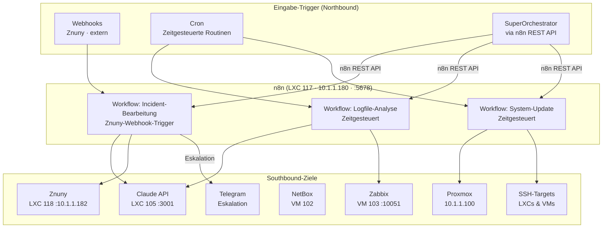
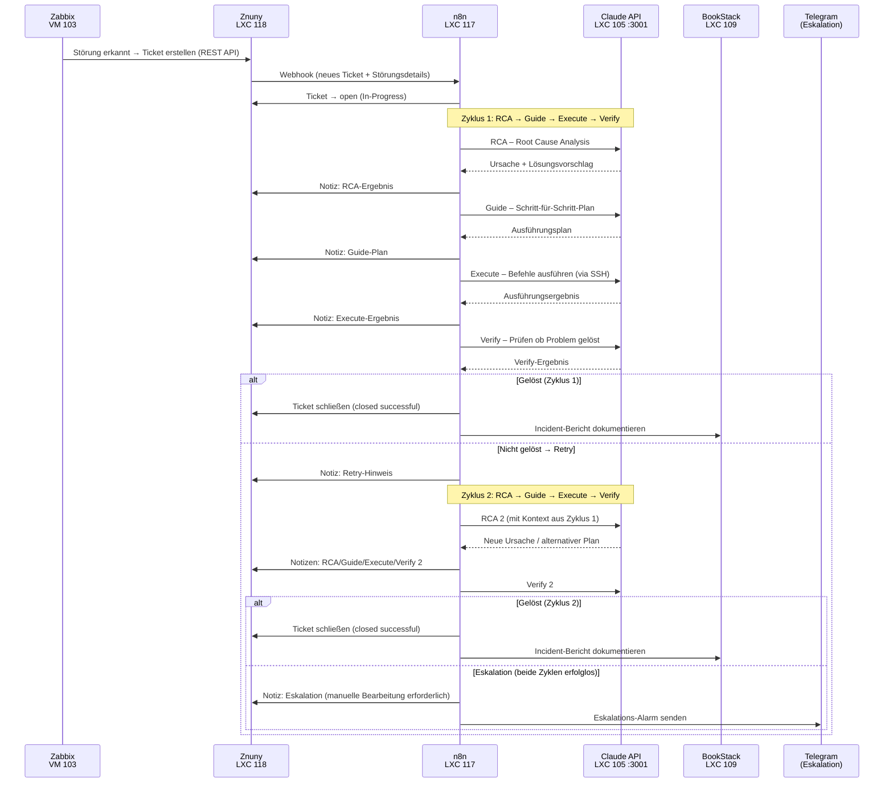
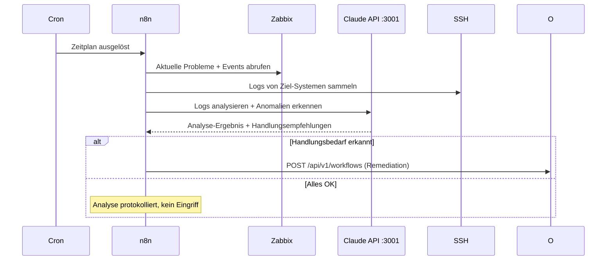
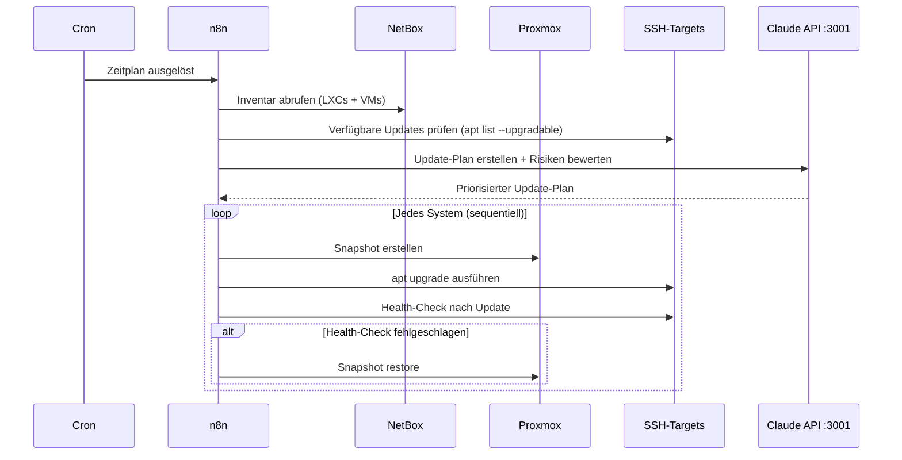

# n8n – Spezifikation

## Rolle & Verantwortung

n8n ist der **Automatisierungs- und Routinen-Dienst** des Systems. Er verarbeitet alle **nicht-menschlichen Inputs** (Webhooks, Zeitpläne) und führt wiederkehrende Workflows eigenständig aus. n8n löst Incidents vollständig selbst über SUB-Workflows und Claude-Analyse — kein Orchestrator-Aufruf.

n8n läuft **eigenständig** und benötigt keine dauerhaften Eingriffe. Der SuperOrchestrator kann Workflows gezielt anstoßen oder neue Workflows über die n8n REST API implementieren lassen.



---

## Technischer Stack

| Komponente | Technologie | Wert |
|-----------|------------|------|
| Plattform | n8n (Node.js) | Low-Code Workflow-Automation |
| LXC | 117 · 10.1.1.180 | systemd-Daemon |
| Port | 5678 | intern (VLAN 99) + optional extern |
| Dienst | `n8n.service` | Restart: always |
| LLM | Claude API LXC 105 :3001 | OpenAI-kompatibel |
| Persistenz | n8n interne SQLite/PostgreSQL | Workflow-State, Execution-History |

---

## Eingabe-Trigger (Northbound)

| Trigger-Typ | Quelle | Beispiele |
|------------|--------|-----------|
| **Webhook** | Znuny (LXC 118) | Ticket-Erstellung bei neuer Störung |
| **Cron** | Intern (n8n Scheduler) | Täglich/wöchentlich Loganalyse, System-Updates |
| **n8n REST API** | SuperOrchestrator | Workflow manuell triggern oder neu anlegen |

---

## Definierte Workflows

### 1. Incident-Bearbeitung

**Trigger:** Znuny-Webhook (bei Ticket-Erstellung durch Zabbix)

**Integrationsfluss:** Zabbix erkennt Störung → erstellt Ticket in Znuny → Znuny triggert n8n-Webhook → n8n bearbeitet Incident und aktualisiert das Znuny-Ticket



> **Hinweis Telegram-Eskalation:** Der Telegram-Aufruf bei Eskalation ist noch zu entwickeln.
> Geplant: `SUB: Telegram Escalation` (neues SUB-Workflow), sendet strukturierte Nachricht an Ops-Channel.

**Schritte:**
1. Zabbix erstellt Ticket in Znuny über REST API (bei jeder Störung)
2. Znuny sendet Webhook-Payload an n8n (Ticket-ID, Störungsdetails)
3. n8n setzt Ticket auf `open` (In-Progress)
4. Zyklus 1: RCA → Guide → Execute → Verify (jeweils Claude API + Znuny-Notiz)
5. Wenn gelöst: Ticket schließen + BookStack-Bericht
6. Wenn nicht gelöst: Retry-Notiz → Zyklus 2 mit erweitertem Kontext
7. Wenn nach Zyklus 2 noch nicht gelöst: Eskalations-Notiz in Znuny + Telegram-Alarm

---

### 2. Zeitgesteuerte Logfile-Analyse

**Trigger:** Cron (konfigurierbar, z.B. täglich 02:00 Uhr)



**Schritte:**
1. Cron-Trigger zur konfigurierten Zeit
2. Zabbix: aktuelle Probleme und Events abrufen
3. SSH: Logs von relevanten LXCs/VMs sammeln
4. Claude API: Logs analysieren, Anomalien und Muster erkennen
5. Bei Handlungsbedarf: kritische Benachrichtigung via SUB: Notification Dispatcher
6. Ergebnis intern protokollieren (n8n Execution History)

---

### 3. Zeitgesteuertes System-Update

**Trigger:** Cron (konfigurierbar, z.B. wöchentlich Sonntag 03:00 Uhr)



**Schritte:**
1. Cron-Trigger zur konfigurierten Zeit
2. NetBox: vollständiges Inventar aller LXCs und VMs abrufen
3. SSH: verfügbare Updates je System prüfen
4. Claude API: Update-Plan mit Risikoabwägung und Reihenfolge erstellen
5. Pro System: Snapshot → Update → Health-Check → ggf. Rollback
6. Ergebnis intern protokollieren (n8n Execution History)

---

## Southbound – Abhängigkeiten

| Ziel | Protokoll | Zweck |
|------|-----------|-------|
| Claude API LXC 105 :3001 | HTTP (OpenAI-kompatibel) | Analyse + Klassifikation via LLM |
| Znuny LXC 118 :10.1.1.182 | REST API | Tickets lesen + aktualisieren + schließen |
| Zabbix VM 103 | REST API | Probleme, Events, Monitoring-Daten |
| NetBox VM 102 | REST API | Infrastruktur-Inventar |
| Proxmox 10.1.1.100 | REST API | Snapshots erstellen / Rollback |
| SSH-Targets | SSH | Befehle auf LXCs/VMs ausführen |
| Telegram | Bot API | Eskalations-Alarm (in Entwicklung) |

---

## Kommunikation mit dem SuperOrchestrator

Der SuperOrchestrator steuert n8n **ausschließlich über die n8n REST API**:

```http
# Bestehenden Workflow triggern
POST http://10.1.1.180:5678/api/v1/workflows/{workflow_id}/activate
X-N8N-API-KEY: <key-aus-vaultwarden>

# Workflow-Execution manuell starten
POST http://10.1.1.180:5678/api/v1/executions
X-N8N-API-KEY: <key-aus-vaultwarden>
```

n8n **läuft eigenständig** für alle laufenden Routinen – der SuperOrchestrator greift nur bei Bedarf ein (neuen Workflow implementieren lassen oder manuell triggern).

---

## Berechtigungen & Credentials

| Ressource | Detail |
|-----------|--------|
| Credentials | Vaultwarden Org „Bots" → Standardsammlung |
| n8n API Key | aus Vaultwarden – genutzt vom SuperOrchestrator |
| Claude API Key | aus Vaultwarden (`Claude API Key`) |
| Zabbix API Token | aus Vaultwarden (`Zabbix API Token`) |
| Znuny API Token | aus Vaultwarden (`Znuny API Token`) |
| NetBox API Token | aus Vaultwarden (`NetBox API Token`) |
| Proxmox API Token | aus Vaultwarden (`Proxmox API Token`) |
| Telegram Bot Token | aus Vaultwarden (`Telegram Bot Token`) – für Eskalation |
| SSH-Keys | lokal auf LXC 117 (ed25519) |
| Netzwerkzugriff | VLAN 99 intern + alle Standorte (WireGuard) |

> n8n-interne Credentials (für Verbindungen in n8n-Workflows) werden in der
> **n8n Credential-Verwaltung** gespeichert – befüllt aus Vaultwarden beim Setup.

---

## Deployment

| Parameter | Wert |
|-----------|------|
| LXC | 117 |
| IP | 10.1.1.180 |
| Port | 5678 |
| Dienst | `n8n.service` (systemd) |
| Ablageort | `/opt/n8n/` |
| Workflow-Ablage | `/opt/Projekte/n8n-workflows/` |
| Logs | `journalctl -u n8n` |

---

## Abgrenzung zu anderen Diensten

| | n8n | SuperOrchestrator |
|--|-----|-----------------|
| **Aufgaben-Typ** | Wiederkehrende Routinen, Event-Reaktionen | Gesamtkoordination, neue Workflows in Auftrag geben |
| **Trigger** | Webhooks, Cron, SO-API | Manuell oder automatisch |
| **Ausführung** | SUB-Workflows + Claude API + SSH | Steuert n8n via REST API |
| **Eigenständigkeit** | Vollständig autonom | Greift nur bei Bedarf ein |
| **LLM-Nutzung** | Analyse, RCA, Remediation | Workflow-Planung |
