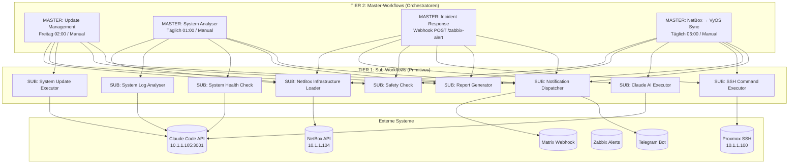

# n8n Workflow-Architektur: 2-Tier Master/Sub System

## Übersicht

Die Workflow-Architektur ist in zwei Ebenen unterteilt:

- **Tier 1 – Sub-Workflows**: Atomare, wiederverwendbare Primitives (werden nie direkt gestartet)
- **Tier 2 – Master-Workflows**: Orchestratoren, die Sub-Workflows koordinieren



---

## Tier 1: Sub-Workflows – Input/Output-Contract

| # | Workflow-Name | Datei | Input-Parameter | Output-Format |
|---|---------------|-------|-----------------|---------------|
| 1 | SUB: NetBox Infrastructure Loader | `sub/sub-netbox-loader.json` | `filter_by_type` (string, opt: vm/lxc/device), `filter_by_ids` (string JSON-Array, opt), `hostname` (string, opt) | Jedes Item: `{id, name, ip, type, ssh_user, ssh_password, cluster}` |
| 2 | SUB: SSH Command Executor | `sub/sub-ssh-executor.json` | `host` (string), `username` (string), `password` (string), `command` (string), `timeout` (number, default 300) | `{exit_code: "success"|"failed", stdout, stderr, execution_time_seconds, session_id, error}` |
| 3 | SUB: Claude AI Executor | `sub/sub-claude-executor.json` | `prompt` (string), `system_prompt` (string, opt), `context` (string, opt) | `{response_text, model, tokens_used, session_id, execution_time_ms}` |
| 4 | SUB: Safety Check | `sub/sub-safety-check.json` | `commands` (string JSON-Array), `risk_threshold` (string: low/medium/high, default medium) | `{safe: bool, violations: [{command, risk, reason}], summary: {total, blocked, highest_risk}}` |
| 5 | SUB: System Update Executor | `sub/sub-update-executor.json` | `id` (number), `name` (string), `ip` (string), `type` (string), `ssh_user` (string), `ssh_password` (string) | `{name, status: "success"|"failed"|"partial", packages_updated, reboot_required, original_state, details}` |
| 6 | SUB: System Log Analyser | `sub/sub-log-analyser.json` | `id` (number), `name` (string), `ip` (string), `type` (string), `ssh_user` (string), `ssh_password` (string), `lines` (number, default 100) | `{name, issues: [{severity, message, timestamp, source}], has_issues: bool, counts: {critical, error, warning}}` |
| 7 | SUB: System Health Check | `sub/sub-health-check.json` | `id` (number), `name` (string), `ip` (string), `type` (string), `ssh_user` (string), `ssh_password` (string) | `{name, health_status: "ok"|"warning"|"critical", disk_usage_pct, memory_usage_pct, cpu_load, services_ok, failed_services}` |
| 8 | SUB: Report Generator | `sub/sub-report-generator.json` | `report_type` (string: update/analyse/incident/generic), `title` (string), `data` (string JSON), `format` (string: markdown/html, default markdown) | `{report_id, report_content, format, report_type, generated_at, char_count}` |
| 9 | SUB: Notification Dispatcher | `sub/sub-notification.json` | `message` (string), `title` (string), `severity` (string: info/warning/critical/success), `channels` (string JSON-Array: ["matrix","telegram"]) | `{notification_id, sent_channels: [], failed_channels: [], status}` |
| 10 | SUB: Znuny Ticket Reader | `sub/sub-znuny-ticket-reader.json` | `ticket_id` (number) | `{ticket_id, title, wer, was, wan, priority, status, queue}` |
| 11 | SUB: Znuny Note Adder | `sub/sub-znuny-note-adder.json` | `ticket_id` (number), `note_title` (string), `note_body` (string) | `{success: bool, note_id, ticket_id, error}` |
| 12 | SUB: Znuny Ticket Closer | `sub/sub-znuny-ticket-closer.json` | `ticket_id` (number), `close_note` (string) | `{success: bool, ticket_id, closed_at, error}` |
| 13 | SUB: BookStack Reporter | `sub/sub-bookstack-reporter.json` | `title` (string), `content_markdown` (string), `tags` (string JSON-Array) | `{success: bool, page_id, page_url, title, chapter_id, error}` |

---

## Tier 2: Master-Workflows – Trigger und Sub-Workflow-Nutzung

| Workflow-Name | Datei | Trigger | Genutzte Sub-Workflows | Beschreibung |
|---------------|-------|---------|------------------------|--------------|
| MASTER: Update Management | `master/master-update.json` | Schedule: Freitag 02:00 + Manual | NetBox Loader, Safety Check, Update Executor, Report Generator, Notification | Wöchentliches apt update/upgrade aller Systeme mit State-Restore für LXCs |
| MASTER: System Analyser | `master/master-analyser.json` | Schedule: Täglich 01:00 + Manual | NetBox Loader, Log Analyser, Health Check, Report Generator, Notification | Tägliche Log-Analyse + Health-Checks mit sofortiger Critical-Alarmierung |
| MASTER: Incident Response | `master/master-incident-response.json` | Webhook POST /webhook/znuny-new-ticket + Manual | Znuny Ticket Reader, NetBox Loader, Claude Executor (4×), Znuny Note Adder (8×), Znuny Ticket Closer, BookStack Reporter, Notification | Vollautomatische RCA→Guide→Execute→Verify mit 2 Versuchen; Eskalation via Matrix an Egon |
| MASTER: NetBox → VyOS Sync | `master/master-netbox-vyos-sync.json` | Schedule: Täglich 06:00 + Manual | NetBox Loader, Safety Check, Claude Executor, SSH Executor, Report Generator, Notification | Synchronisiert NetBox-Daten (DNS, Adressgruppen) nach VyOS |

---

## Deployment-Anleitung

### Voraussetzungen

- n8n auf LXC 117, IP `10.1.1.180`, Port 5678
- NetBox API: `10.1.1.104`, Token: `6e517f4e4fd4b3f3d3de63770bd79e6faacf0fe4`
- Claude Code API: `http://10.1.1.105:3001/v1/chat/completions` (OpenAI-kompatibel)
- Matrix Webhook: URL in `sub/sub-notification.json` anpassen
- Telegram Bot Token: In `sub/sub-notification.json` anpassen

### Import-Reihenfolge (WICHTIG: Erst Sub, dann Master)

**Schritt 1: Alle Sub-Workflows importieren**

Reihenfolge ist bei Sub-Workflows egal:

```
sub/sub-netbox-loader.json
sub/sub-ssh-executor.json
sub/sub-claude-executor.json
sub/sub-safety-check.json
sub/sub-update-executor.json
sub/sub-log-analyser.json
sub/sub-health-check.json
sub/sub-report-generator.json
sub/sub-notification.json
sub/sub-znuny-ticket-reader.json
sub/sub-znuny-note-adder.json
sub/sub-znuny-ticket-closer.json
sub/sub-bookstack-reporter.json
```

**Schritt 2: Master-Workflows importieren**

Reihenfolge ist bei Master-Workflows egal:

```
master/master-update.json
master/master-analyser.json
master/master-incident-response.json
master/master-netbox-vyos-sync.json
```

**Schritt 3: Sub-Workflows aktivieren**

Alle Sub-Workflows MÜSSEN aktiviert sein, damit Master-Workflows sie per `executeWorkflow` aufrufen können:

```
n8n GUI → Workflows → Jeden Sub-Workflow öffnen → Toggle "Active" ON
```

**Schritt 4: Konfiguration anpassen**

Vor dem ersten Run anpassen:

| Datei | Was anpassen |
|-------|-------------|
| `sub/sub-notification.json` | Matrix Room ID, Matrix Token, Telegram Bot Token, Telegram Chat ID |
| `master/master-netbox-vyos-sync.json` | VyOS Host IP, VyOS SSH Password |
| `sub/sub-ssh-executor.json` | SSH-Credentials kommen aus NetBox custom_fields – dort eintragen |

**Schritt 5: Master-Workflows aktivieren**

```
n8n GUI → Jeden Master-Workflow öffnen → Toggle "Active" ON
```

### Webhook-URL für Znuny

Nach Import und Aktivierung des Incident-Response-Masters:

```
http://10.1.1.180:5678/webhook/znuny-new-ticket
```

**Option A – Znuny GenericAgent (bevorzugt):**
- Znuny: Admin → GenericAgent → Ereignis "Ticket erstellt"
- Aktion: HTTP-Request → POST `http://10.1.1.180/webhook/znuny-new-ticket`
- Body (JSON):
```json
{ "ticket_id": "<OTRS_TICKET_TicketID>" }
```

**Option B – Polling (Fallback):**
Manueller Trigger + Ticket-ID eingeben für Tests.

**Konfiguration vor Produktiveinsatz:**

| Datei | Was anpassen |
|-------|-------------|
| `sub/sub-znuny-ticket-reader.json` | `PLACEHOLDER_ZNUNY_TOKEN` → echter Znuny API-Token |
| `sub/sub-znuny-note-adder.json` | `PLACEHOLDER_ZNUNY_TOKEN` → echter Znuny API-Token |
| `sub/sub-znuny-ticket-closer.json` | `PLACEHOLDER_ZNUNY_TOKEN` → echter Znuny API-Token |
| `sub/sub-bookstack-reporter.json` | `PLACEHOLDER_BOOKSTACK_TOKEN_ID:PLACEHOLDER_BOOKSTACK_TOKEN_SECRET` → echte BookStack Token ID und Secret |
| `sub/sub-notification.json` | Matrix Room ID und Token für Egon-Kanal |

**Znuny API-Token ermitteln:**
```bash
# Im Znuny Admin-Interface:
# Admin → System Administration → Web Services → REST API
# oder: Admin → Users → User bearbeiten → API Access Token
```

---

## Naming Conventions

### Workflow-Namen

| Typ | Prefix | Beispiel |
|-----|--------|---------|
| Sub-Workflow (Tier 1) | `SUB:` | `SUB: NetBox Infrastructure Loader` |
| Master-Workflow (Tier 2) | `MASTER:` | `MASTER: Update Management` |

### Node-Namen

Jeder Node-Name beginnt mit einem Emoji das die Funktion kommuniziert:

| Emoji | Bedeutung |
|-------|-----------|
| 📥 | Input/Trigger (Einstiegspunkt) |
| 🔧 | Code-Node (Datenverarbeitung) |
| 🔍 | HTTP Request (Lesen/Abfragen) |
| 🤖 | Claude AI Aufruf |
| 💻 | SSH Ausführung |
| 🔗 | Sub-Workflow Aufruf |
| 🛡️ | Safety/Sicherheits-Check |
| ✅ | IF/Entscheidungs-Node |
| 🔀 | Switch/Routing-Node |
| 🔄 | Loop/Batch-Node oder Update-Ausführung |
| 📊 | Report-Generierung |
| 🔔 | Notification/Benachrichtigung |
| 📋 | Set-Node (Konfiguration) |
| ⏰ | Schedule-Trigger |
| ▶️ | Manual-Trigger |
| 🌐 | Webhook-Trigger oder externe HTTP |
| 📨 | Message senden |
| ⚠️ | Warning/Fehler-Logging |
| 🚨 | Critical Alert |
| 📝 | Response/Output |

### Dateinamen

```
sub/sub-<funktionsname>.json      # Sub-Workflows
master/master-<funktionsname>.json  # Master-Workflows
```

---

## Erweiterungsrichtlinien

### Neuen Sub-Workflow hinzufügen

1. Datei erstellen: `sub/sub-meine-funktion.json`
2. Trigger-Node: `executeWorkflowTrigger` (typeVersion 1.1) mit `workflowInputs`
3. Settings: `"callerPolicy": "workflowsFromSameOwner"`
4. Name-Prefix: `"SUB: Meine Funktion"`
5. In n8n importieren und **aktivieren**
6. Diese Dokumentation ergänzen (Tabelle Tier 1)

### Neuen Master-Workflow hinzufügen

1. Datei erstellen: `master/master-mein-orchestrator.json`
2. Trigger: `scheduleTrigger` + `manualTrigger` (beide verbunden mit erstem Verarbeitungs-Node)
3. Settings: `"callerPolicy": "workflowsFromSameOwner"`, `"saveManualExecutions": true`
4. Name-Prefix: `"MASTER: Mein Orchestrator"`
5. Sub-Workflows per `executeWorkflow` mit `"mode": "name"` aufrufen (nicht per ID)
6. In n8n importieren → Sub-Workflows prüfen → aktivieren
7. Diese Dokumentation ergänzen (Tabelle Tier 2)

### Sub-Workflow aufrufen (Template)

```json
{
  "parameters": {
    "source": "database",
    "workflowId": {
      "__rl": true,
      "mode": "name",
      "value": "SUB: NetBox Infrastructure Loader"
    },
    "workflowInputs": {
      "value": {
        "filter_by_type": "lxc"
      },
      "schema": [
        {
          "id": "filter_by_type",
          "displayName": "filter_by_type",
          "required": false,
          "type": "string"
        }
      ]
    },
    "options": {}
  },
  "name": "🔗 SUB: NetBox Loader",
  "type": "n8n-nodes-base.executeWorkflow",
  "typeVersion": 1.1
}
```

### Wichtige Regeln

1. **Sub-Workflows sind statuslos**: Sie lesen ihre Config ausschließlich aus Input-Parametern
2. **Kein Hardcoding von IDs**: `executeWorkflow` immer mit `"mode": "name"` – nie `"mode": "id"`
3. **continueOnFail bei HTTP**: Alle externen HTTP-Calls (NetBox, Claude, Matrix) nutzen `continueOnFail: true`
4. **JSON-only von Claude**: Alle Claude-Prompts enden mit "Respond ONLY with valid JSON"
5. **Safety immer vor Execution**: Keine SSH-Ausführung ohne vorherigen SUB: Safety Check
6. **LXC-Unterscheidung**: Für LXC-Container immer `pct exec <id> --` via Proxmox, nicht direkt SSH

---

## Systemübersicht

| Komponente | Adresse | Zweck |
|------------|---------|-------|
| n8n | 10.1.1.180:5678 | Workflow-Engine |
| NetBox API | 10.1.1.104 | Infrastructure Source of Truth |
| Claude Code API | 10.1.1.105:3001 | KI-Ausführung (OpenAI-kompatibel) |
| Proxmox | 10.1.1.100 | LXC/VM-Verwaltung via SSH |
| Matrix | matrix.doehlercomputing.de | Notifications |

---

## Znuny REST API – Referenz

**Base-URL (Generic Interface):**
```
http://10.1.1.182/znuny/nph-genericinterface.pl/Webservice/GenericTicketConnectorREST/
```

**Authentifizierung:** `UserLogin` + `Password` im Request-Body (oder als Query-Parameter bei GET).

| Operation | Methode | Endpoint | Auth |
|-----------|---------|----------|------|
| Ticket lesen | GET | `/Ticket/<id>?UserLogin=...&Password=...` | Query-Params |
| Ticket erstellen | POST | `/Ticket` | Body |
| Ticket updaten / Note hinzufügen | PATCH | `/Ticket/<id>` | Body |
| Ticket schließen | PATCH | `/Ticket/<id>` (State im Body) | Body |
| Ticket suchen | POST | `/Ticket/Search` | Body |
| Session erstellen | POST | `/Session` | Body |

**Note hinzufügen (PATCH-Body):**
```json
{
  "UserLogin": "...", "Password": "...",
  "Article": {
    "CommunicationChannel": "Internal",
    "SenderType": "agent",
    "IsVisibleForCustomer": "0",
    "Subject": "Titel",
    "Body": "Inhalt",
    "ContentType": "text/plain; charset=utf8"
  }
}
```

**Ticket schließen + Note (ein Request):**
```json
{
  "UserLogin": "...", "Password": "...",
  "Ticket": { "State": "closed successful" },
  "Article": { "Subject": "Abschluss", "Body": "...", ... }
}
```

**DynamicFields** kommen als `DynamicField_<Name>` direkt im Ticket-Objekt:
```json
{ "TicketID": 42, "Title": "...", "DynamicField_Wer": "server-01", "DynamicField_Was": "High CPU", "DynamicField_Wan": "2026-03-15 10:00" }
```

### Trigger-Optionen (Znuny → n8n)

**Option A – Invoker Ticket::Generic (empfohlen):**
- Znuny sendet bei `TicketCreate` das **vollständige Ticket-Objekt** inkl. aller DynamicFields
- Konfiguration: Admin → Web Services → neuer Webservice → Requester → Invoker: `Ticket::Generic`
- Event: `TicketCreate`, URL: `http://10.1.1.180:5678/webhook/znuny-new-ticket`
- n8n-Master erkennt die Payload und überspringt den separaten Ticket-Reader-Call
- Payload: `{ "Event": { "Event": "TicketCreate", "TicketID": "42" }, "Ticket": {...} }`

**Option B – GenericAgent (einfacher einzurichten):**
- Konfiguration: Admin → GenericAgent → Event Based → `TicketCreate`
- Modul: `Kernel::System::GenericAgent::ExecuteInvoker`
- Sendet nur `{ "ticket_id": "<ID>" }` → n8n holt Ticket-Details via Ticket Reader
- Oder: Direkte HTTP-Aktion mit Custom-Payload

### Wichtige Znuny-Event-Liste (für Invoker-Trigger)

| Event | Beschreibung |
|-------|-------------|
| `TicketCreate` | Neues Ticket erstellt |
| `TicketStateUpdate` | Status-Änderung |
| `TicketQueueUpdate` | Queue-Änderung |
| `TicketDynamicFieldUpdate_Wer` | DynamicField 'Wer' geändert |
| `EscalationResponseTimeStart` | Eskalation gestartet |
| `ArticleCreate` | Neuer Artikel/Nachricht |

---

_Stand: 2026-03-15 | Architektur v2.1 (2-Tier Master/Sub + Znuny Integration)_
