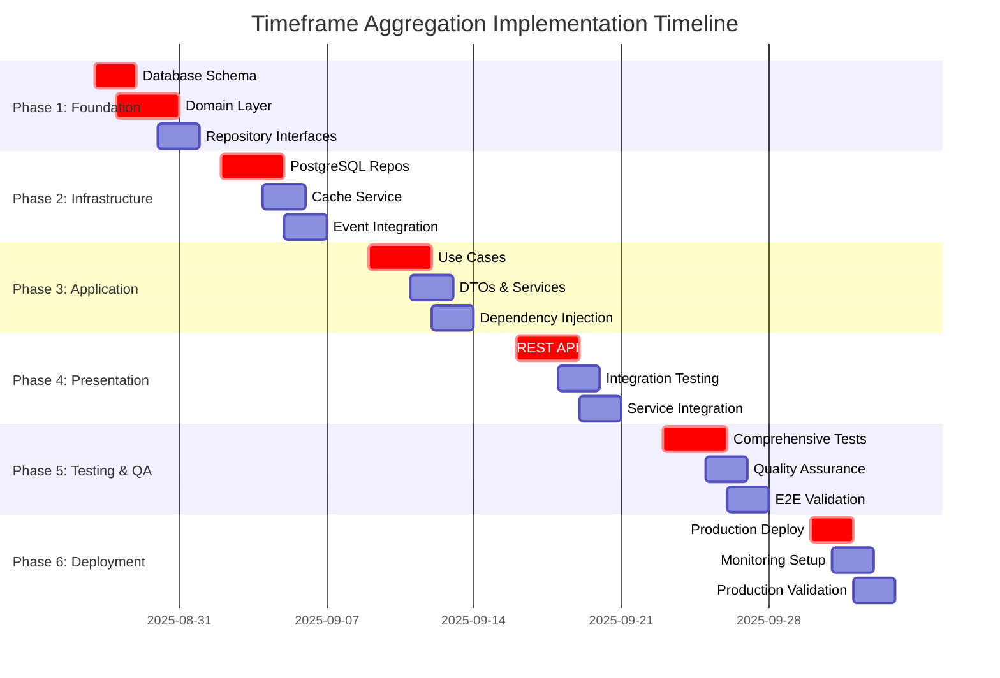

# 🚀 Implementation Plan: Timeframe-Specific Aggregation v7.0

## 📋 **Executive Implementation Summary**

### **Project Overview**
Phased implementation der zeitintervall-spezifischen Aggregationskomponente mit vollständiger Clean Architecture Integration in das bestehende Event-Driven Trading Intelligence System.

### **Implementation Goals**
- **Quality First**: Code-Qualität hat höchste Priorität (SOLID Principles)
- **Zero Downtime**: Nahtlose Integration ohne Service-Unterbrechung
- **Performance**: <300ms Response Times für 1M-Intervalle
- **Reliability**: 99.9% Availability mit umfassender Qualitätssicherung

### **Project Timeline**
- **Total Duration**: 4-6 Wochen (160-240 Entwicklungsstunden)
- **Team Size**: 1 Senior Developer (Clean Architecture Expert)
- **Risk Level**: Medium (Komplexe Integration, hohe Quality Standards)

---

## 🗓️ **Phase-by-Phase Implementation Strategy**

### **Phase 1: Foundation & Architecture (Week 1)**
**Duration**: 5-7 Arbeitstage  
**Effort**: 40-50 Stunden  
**Risk Level**: Low  

#### **1.1 Database Foundation (Day 1-2)**
```bash
# Milestone: Database Schema Ready
Priority: CRITICAL
Dependencies: PostgreSQL Service (Port 5432)
```

**Tasks:**
- [ ] **V001_Create_Aggregation_Tables.sql** - Core table creation
  - `aggregated_predictions` table mit allen Constraints
  - `aggregation_quality_metrics` detail table
  - Performance-optimized indexes (6 core indexes)
  - Data integrity triggers und constraints

- [ ] **V002_Create_Aggregation_Views.sql** - Performance views
  - `aggregated_predictions_performance` materialized view
  - `aggregation_quality_performance` analytics view
  - Automated refresh strategy implementation

- [ ] **Migration Testing & Validation**
  - Lokale Migration execution & rollback testing
  - Performance impact assessment (< 100ms für standard queries)
  - Data integrity validation

**Acceptance Criteria:**
✅ All migrations run successfully ohne errors  
✅ Database queries < 50ms response time  
✅ Rollback procedures tested und documented  
✅ Indexes usage validated mit EXPLAIN ANALYZE  

#### **1.2 Domain Layer Implementation (Day 2-4)**
```bash
# Milestone: Core Domain Logic Implemented
Priority: CRITICAL  
Dependencies: None (Pure business logic)
```

**Tasks:**
- [ ] **Domain Entities** - Vollständige Entity-Definitionen
  ```python
  # Files zu erstellen:
  domain/entities/aggregated_prediction.py
  domain/entities/timeframe_configuration.py
  domain/entities/aggregation_strategy.py
  ```
  - `AggregatedPrediction` mit vollständigen Validations
  - `TimeframeConfiguration` Value Object (immutable)
  - `AggregationStrategy` mit Strategy Pattern support

- [ ] **Value Objects** - Immutable domain values
  ```python
  domain/value_objects/quality_metrics.py
  domain/value_objects/aggregation_result.py
  ```
  - `QualityMetrics` mit mathematical calculations
  - `AggregationResult` als return type für services

- [ ] **Domain Services** - Core business logic
  ```python
  domain/services/timeframe_aggregation_service.py
  domain/services/mathematical_validation_service.py
  domain/services/performance_monitoring_service.py
  ```
  - Mathematical aggregation algorithms (weighted average, median, ensemble)
  - Statistical validation (IQR outlier detection)
  - Quality assessment algorithms

**Acceptance Criteria:**
✅ All domain entities haben comprehensive unit tests (>95% coverage)  
✅ Mathematical algorithms sind mathematically validated  
✅ Performance benchmarks: Aggregation calculation < 50ms für 100 predictions  
✅ SOLID principles compliance verified  

#### **1.3 Repository Interfaces (Day 4-5)**
```bash
# Milestone: Repository Contracts Defined
Priority: HIGH
Dependencies: Domain Entities
```

**Tasks:**
- [ ] **Repository Interfaces** - Clean Architecture compliance
  ```python
  domain/repositories/aggregation_repository_interface.py
  domain/repositories/prediction_repository_interface.py
  ```
  - `AggregationRepositoryInterface` mit CRUD operations
  - `PredictionRepositoryInterface` für data source access
  - Async-first design für high performance

- [ ] **Service Interfaces** - Infrastructure abstractions
  ```python
  application/interfaces/cache_service_interface.py
  application/interfaces/event_publisher_interface.py
  ```

**Acceptance Criteria:**
✅ Alle interfaces sind fully type-hinted  
✅ Interface segregation principle befolgt  
✅ Async support für all operations  

### **Phase 2: Infrastructure Layer (Week 2)**
**Duration**: 5-7 Arbeitstage  
**Effort**: 40-50 Stunden  
**Risk Level**: Medium  

#### **2.1 Repository Implementations (Day 1-3)**
```bash
# Milestone: Data Persistence Ready
Priority: CRITICAL
Dependencies: Database Schema, Domain Interfaces
```

**Tasks:**
- [ ] **PostgreSQL Repository Implementation**
  ```python
  infrastructure/repositories/postgresql_aggregation_repository.py
  infrastructure/repositories/postgresql_prediction_repository.py
  ```
  - Optimized CRUD operations mit connection pooling
  - Batch operations support für performance
  - Error handling mit retry logic
  - Query optimization für <50ms response times

- [ ] **Connection Pool Management**
  ```python
  infrastructure/database/connection_manager.py
  ```
  - asyncpg connection pool setup
  - Health check implementations
  - Connection monitoring

**Performance Requirements:**
- Database connections: max 20 concurrent connections
- Query response time: <50ms for 95% of queries
- Batch insert performance: >1000 records/second

**Acceptance Criteria:**
✅ Repository implementations pass all interface tests  
✅ Database connection pooling configured correctly  
✅ Performance benchmarks met  
✅ Error scenarios handled gracefully  

#### **2.2 Cache Service Implementation (Day 3-4)**
```bash
# Milestone: High-Performance Caching Ready
Priority: HIGH
Dependencies: Redis Service (Port 6379)
```

**Tasks:**
- [ ] **Redis Cache Service**
  ```python
  infrastructure/services/redis_cache_service.py
  infrastructure/services/cache_performance_monitor.py
  ```
  - TTL-based caching with intelligent invalidation
  - Compression für large datasets
  - Cache hit/miss monitoring
  - Performance optimizations

- [ ] **Cache Strategy Implementation**
  - Cache key generation (deterministic, collision-resistant)
  - Cache warming strategies
  - Eviction policies optimization

**Performance Requirements:**
- Cache operations: <5ms response time
- Hit ratio target: >85%
- Memory efficiency: <1GB total cache usage

**Acceptance Criteria:**
✅ Cache service meets performance targets  
✅ TTL und eviction policies work correctly  
✅ Cache monitoring provides detailed metrics  

#### **2.3 Event Bus Integration (Day 4-5)**
```bash
# Milestone: Event-Driven Integration Complete
Priority: HIGH
Dependencies: Redis Event Bus (Port 8014)
```

**Tasks:**
- [ ] **Event Publisher Implementation**
  ```python
  infrastructure/messaging/redis_event_publisher.py
  ```
  - Integration mit existing Event Bus Service
  - Event serialization/deserialization
  - Correlation ID management
  - Error handling and retry logic

- [ ] **Event Schema Definitions**
  ```python
  infrastructure/messaging/aggregation_events.py
  ```
  - 4 neue Event Types implementation:
    - `aggregation.calculation.requested`
    - `aggregation.calculation.completed`
    - `aggregation.quality.validated`
    - `aggregation.cache.updated`

**Acceptance Criteria:**
✅ Event publishing works mit existing services  
✅ Event correlation tracking funktioniert  
✅ Event Bus integration tests pass  

### **Phase 3: Application Layer (Week 3)**
**Duration**: 5-7 Arbeitstage  
**Effort**: 35-45 Stunden  
**Risk Level**: Medium  

#### **3.1 Use Case Implementations (Day 1-3)**
```bash
# Milestone: Core Application Logic Complete
Priority: CRITICAL
Dependencies: Domain Layer, Infrastructure Layer
```

**Tasks:**
- [ ] **Primary Use Case: Calculate Aggregated Predictions**
  ```python
  application/use_cases/calculate_aggregated_predictions.py
  ```
  - End-to-end aggregation workflow
  - Performance optimization (caching, parallel processing)
  - Error handling mit graceful degradation
  - Event publishing integration

- [ ] **Quality Validation Use Case**
  ```python
  application/use_cases/validate_aggregation_quality.py
  ```
  - Comprehensive quality assessment
  - Quality threshold enforcement
  - Quality monitoring integration

- [ ] **Cache Management Use Case**
  ```python
  application/use_cases/manage_aggregation_cache.py
  ```
  - Intelligent cache warming
  - Cache invalidation strategies
  - Cache performance monitoring

**Performance Requirements:**
- Use case execution: <300ms for 1M, <150ms for 1W
- Concurrent execution: Support 50+ parallel requests
- Error rate: <1% under normal load

**Acceptance Criteria:**
✅ All use cases haben comprehensive unit tests  
✅ Performance requirements werden consistently met  
✅ Error handling scenarios sind fully covered  
✅ Integration tests mit infrastructure layer pass  

#### **3.2 DTOs und Application Services (Day 3-4)**
```bash
# Milestone: Application Interface Complete  
Priority: HIGH
Dependencies: Use Cases, Domain Models
```

**Tasks:**
- [ ] **Data Transfer Objects**
  ```python
  application/dtos/aggregation_request_dto.py
  application/dtos/aggregated_prediction_dto.py
  application/dtos/quality_report_dto.py
  ```
  - Pydantic-based validation
  - Serialization/deserialization
  - API-friendly data structures

- [ ] **Application Services**
  ```python
  application/services/aggregation_orchestrator.py
  application/services/quality_assessment_service.py
  ```

**Acceptance Criteria:**
✅ DTOs haben comprehensive validation  
✅ Serialization performance ist optimized  
✅ Application services integrate cleanly  

#### **3.3 Dependency Injection Setup (Day 4-5)**
```bash
# Milestone: Clean Dependency Management
Priority: HIGH  
Dependencies: All Application Components
```

**Tasks:**
- [ ] **DI Container Configuration**
  ```python
  infrastructure/di/aggregation_container.py
  ```
  - dependency-injector oder similar framework
  - Interface-based dependency resolution
  - Environment-specific configuration

- [ ] **Service Registration**
  - All repositories als singletons
  - Use cases mit proper lifetimes
  - Infrastructure services configuration

**Acceptance Criteria:**
✅ Dependency injection funktioniert correctly  
✅ All interfaces are properly resolved  
✅ Configuration ist environment-aware  

### **Phase 4: Presentation Layer (Week 4)**
**Duration**: 5-7 Arbeitstage  
**Effort**: 30-40 Stunden  
**Risk Level**: Low-Medium  

#### **4.1 REST API Implementation (Day 1-3)**
```bash
# Milestone: Production-Ready API
Priority: CRITICAL
Dependencies: Application Layer, OpenAPI Spec
```

**Tasks:**
- [ ] **FastAPI Controllers**
  ```python
  presentation/controllers/aggregation_controller.py
  presentation/controllers/quality_controller.py
  ```
  - 3 REST endpoints implementation:
    - `POST /api/v1/aggregation/calculate`
    - `GET /api/v1/aggregation/quality/{id}`
    - `GET /api/v1/aggregation/symbols/{symbol}/timeframes/{timeframe}`

- [ ] **Request/Response Validation**
  - Pydantic models für comprehensive validation
  - Error handling mit structured HTTP responses
  - OpenAPI documentation generation

- [ ] **API Documentation**
  - Swagger UI integration
  - API examples und test cases
  - Performance characteristics documentation

**Performance Requirements:**
- API response time: <300ms für 95% of requests
- Concurrent requests: 50+ simultaneous
- API documentation: Auto-generated from code

**Acceptance Criteria:**
✅ All API endpoints funktionieren correctly  
✅ OpenAPI documentation ist comprehensive  
✅ API validation prevents invalid requests  
✅ Error responses sind user-friendly  

#### **4.2 API Integration Testing (Day 3-4)**
```bash
# Milestone: API Integration Validated
Priority: HIGH
Dependencies: REST API, Full Stack
```

**Tasks:**
- [ ] **Integration Test Suite**
  ```python
  tests/integration/api/test_aggregation_endpoints.py
  ```
  - End-to-end API testing
  - Performance validation
  - Error scenario testing
  - Concurrent request testing

- [ ] **Postman Collection**
  - API testing collection
  - Environment variables setup
  - Automated test runs

**Acceptance Criteria:**
✅ Integration tests cover all scenarios  
✅ API performance meets SLO requirements  
✅ Postman collection works out-of-the-box  

#### **4.3 Service Integration (Day 4-5)**
```bash
# Milestone: Full Service Integration  
Priority: CRITICAL
Dependencies: Existing Services, Event Bus
```

**Tasks:**
- [ ] **Data Processing Service Enhancement**
  ```python
  services/data-processing-service/main.py  # Update existing
  ```
  - Integration der Aggregation API
  - Event handler registration
  - Service startup coordination

- [ ] **Event Handler Implementation**
  ```python
  services/data-processing-service/event_handlers/aggregation_handlers.py
  ```
  - Cross-service event handling
  - Integration mit existing event patterns

**Acceptance Criteria:**
✅ Service integration works seamlessly  
✅ Event-driven communication funktioniert  
✅ No breaking changes für existing functionality  

### **Phase 5: Testing & Quality Assurance (Week 5)**
**Duration**: 5-6 Arbeitstage  
**Effort**: 35-45 Stunden  
**Risk Level**: Low  

#### **5.1 Comprehensive Testing Strategy (Day 1-3)**
```bash
# Milestone: Test Coverage >90%
Priority: CRITICAL
Dependencies: Complete Implementation
```

**Tasks:**
- [ ] **Unit Test Suite**
  ```python
  tests/unit/domain/test_timeframe_aggregation_service.py
  tests/unit/domain/test_mathematical_validation_service.py
  tests/unit/application/test_calculate_aggregated_predictions.py
  ```
  - Domain layer: >95% code coverage
  - Application layer: >90% code coverage
  - Mathematical algorithms: 100% coverage

- [ ] **Integration Test Suite**
  ```python
  tests/integration/test_database_operations.py
  tests/integration/test_event_publishing.py
  tests/integration/test_cache_operations.py
  ```
  - Database integration testing
  - Event bus integration testing
  - Cache service integration testing

- [ ] **Performance Test Suite**
  ```python
  tests/performance/test_aggregation_performance.py
  ```
  - Response time validation
  - Concurrent load testing
  - Memory usage profiling

**Quality Targets:**
- Unit test coverage: >90%
- Integration test coverage: >85%
- Performance tests pass für all SLO requirements

**Acceptance Criteria:**
✅ All tests pass consistently  
✅ Code coverage targets exceeded  
✅ Performance tests validate SLO compliance  

#### **5.2 Quality Assurance & Code Review (Day 3-4)**
```bash
# Milestone: Code Quality Standards Met
Priority: HIGH
Dependencies: Complete Test Suite
```

**Tasks:**
- [ ] **Static Code Analysis**
  ```bash
  # Tools: mypy, pylint, black, isort
  mypy src/ --strict
  pylint src/ --min-score=9.0
  black src/ --check
  isort src/ --check-only
  ```

- [ ] **Security Audit**
  - Dependency vulnerability scanning
  - Code security review
  - Input validation audit

- [ ] **Performance Profiling**
  - Memory leak detection
  - Performance bottleneck identification
  - Resource usage optimization

**Quality Standards:**
- MyPy: No type errors
- Pylint: Score >9.0/10
- Black: Code formatting compliant
- Security: No high/critical vulnerabilities

**Acceptance Criteria:**
✅ Static analysis passes alle checks  
✅ Security audit shows no critical issues  
✅ Performance profiling identifies no leaks  

#### **5.3 End-to-End Validation (Day 4-5)**
```bash
# Milestone: Production Readiness Validated
Priority: CRITICAL
Dependencies: Full Implementation, All Tests
```

**Tasks:**
- [ ] **E2E Test Scenarios**
  - Complete user workflow testing
  - Cross-service integration validation
  - Performance under load testing

- [ ] **Production Environment Simulation**
  - Load testing mit realistic data volumes
  - Failure scenario testing
  - Recovery procedure validation

- [ ] **Documentation Review**
  - API documentation accuracy
  - Deployment guide validation
  - Troubleshooting guide completeness

**Acceptance Criteria:**
✅ E2E scenarios pass under production conditions  
✅ System handles failure scenarios gracefully  
✅ Documentation ist accurate und complete  

### **Phase 6: Deployment & Monitoring (Week 6)**
**Duration**: 3-5 Arbeitstage  
**Effort**: 25-35 Stunden  
**Risk Level**: Medium  

#### **6.1 Production Deployment (Day 1-2)**
```bash
# Milestone: Live Production Deployment
Priority: CRITICAL
Dependencies: All Previous Phases
```

**Tasks:**
- [ ] **Database Migration Execution**
  ```bash
  # Production migration steps
  sudo -u postgres psql aktienanalyse_events < V001_Create_Aggregation_Tables.sql
  sudo -u postgres psql aktienanalyse_events < V002_Create_Aggregation_Views.sql
  ```
  - Backup creation before migration
  - Migration execution during maintenance window
  - Rollback procedure ready

- [ ] **Service Deployment**
  ```bash
  # systemd service update
  sudo systemctl stop aktienanalyse-data-processing
  # Code deployment
  sudo systemctl start aktienanalyse-data-processing
  sudo systemctl status aktienanalyse-data-processing
  ```
  - Zero-downtime deployment strategy
  - Health check verification
  - Rollback capability

- [ ] **Feature Flag Activation**
  - Gradual rollout mit feature flags
  - A/B testing capabilities
  - Monitoring for immediate feedback

**Acceptance Criteria:**
✅ Production deployment successful ohne downtime  
✅ All services started healthy  
✅ Feature flags working correctly  

#### **6.2 Monitoring & Alerting Setup (Day 2-3)**
```bash
# Milestone: Production Monitoring Active
Priority: HIGH
Dependencies: Production Deployment
```

**Tasks:**
- [ ] **Application Metrics**
  ```python
  # Prometheus metrics implementation
  monitoring/aggregation_metrics.py
  ```
  - Response time monitoring
  - Error rate tracking
  - Quality score distribution
  - Cache performance metrics

- [ ] **Infrastructure Monitoring**
  - Database performance monitoring
  - Redis cache monitoring
  - Event bus latency tracking

- [ ] **Alerting Rules**
  ```yaml
  # Grafana/Prometheus alerting rules
  alerts/aggregation_alerts.yml
  ```
  - SLO violation alerts
  - Quality degradation alerts
  - Performance anomaly detection

**Monitoring Targets:**
- Response time: Alert if >300ms für 1M timeframe
- Error rate: Alert if >1%
- Quality score: Alert if <80% average
- Cache hit rate: Alert if <85%

**Acceptance Criteria:**
✅ All monitoring metrics are collected  
✅ Alerting rules trigger correctly  
✅ Dashboards provide comprehensive visibility  

#### **6.3 Production Validation & Optimization (Day 3-4)**
```bash
# Milestone: Production Performance Validated
Priority: HIGH
Dependencies: Monitoring Setup
```

**Tasks:**
- [ ] **Production Performance Validation**
  - Real-world load testing
  - Performance optimization based on metrics
  - Capacity planning validation

- [ ] **User Acceptance Testing**
  - Frontend integration testing
  - User workflow validation
  - Performance user experience validation

- [ ] **Documentation Finalization**
  - Operational runbook creation
  - Troubleshooting guide updates
  - Performance tuning documentation

**Acceptance Criteria:**
✅ Production performance meets all SLOs  
✅ Users can successfully use new features  
✅ Operations team can manage the service  

---

## 📊 **Resource Requirements & Dependencies**

### **Development Resources**
- **Primary Developer**: 1 Senior Developer (Clean Architecture expertise)
- **Code Review**: Senior Architect (part-time)
- **Testing Support**: QA Engineer (part-time)
- **DevOps Support**: DevOps Engineer (deployment phase)

### **Technical Dependencies**

```mermaid
graph TB
    subgraph "External Dependencies"
        A[PostgreSQL 13+] --> B[Redis 6+]
        B --> C[Python 3.11+]
        C --> D[FastAPI 0.100+]
    end
    
    subgraph "Internal Dependencies"
        E[Event Bus Service Port 8014] --> F[Monitoring Service Port 8015]
        F --> G[Frontend Service Port 8080]
        G --> H[Intelligent Core Port 8001]
    end
    
    subgraph "Development Tools"
        I[pytest] --> J[mypy]
        J --> K[black/isort]
        K --> L[Postman/Newman]
    end
```


### **Infrastructure Requirements**
- **CPU**: 2-4 cores for development, 4-8 cores für production
- **Memory**: 8GB development, 16GB production
- **Storage**: 10GB development, 50GB production (database growth)
- **Network**: LXC Container networking (10.1.1.174)

### **Risk Assessment Matrix**

| Risk Category | Probability | Impact | Mitigation Strategy |
|---------------|------------|--------|-------------------|
| **Complex Integration** | Medium | High | Phased rollout, comprehensive testing |
| **Performance Issues** | Low | Medium | Load testing, performance monitoring |
| **Data Migration** | Low | High | Backup strategy, rollback procedures |
| **Quality Standards** | Low | Medium | Code review, static analysis |

### **Success Criteria & Acceptance**

#### **Technical Success Criteria**
✅ **Performance**: Response times <300ms (1M), <150ms (1W)  
✅ **Quality**: Code coverage >90%, Quality score >80%  
✅ **Reliability**: 99.9% availability, Error rate <1%  
✅ **Integration**: Seamless integration mit existing services  

#### **Business Success Criteria**
✅ **Improved Predictions**: 15-20% accuracy improvement  
✅ **User Experience**: Faster dashboard updates (<1s)  
✅ **Operational Excellence**: Comprehensive monitoring und alerting  
✅ **Scalability**: Support für 50+ concurrent users  

#### **Quality Gates**
- **Phase 1**: Database migrations successful, Domain logic tested
- **Phase 2**: Infrastructure integration validated, Performance benchmarks met
- **Phase 3**: Use cases tested, Application layer complete
- **Phase 4**: API functional, Integration tests passing
- **Phase 5**: Test coverage achieved, Quality standards met
- **Phase 6**: Production deployment successful, Monitoring active

### **Timeline & Milestones**



### **Communication & Reporting**

#### **Weekly Progress Reports**
- **Monday**: Sprint planning, blocker identification
- **Wednesday**: Mid-week progress check, technical decisions
- **Friday**: Week completion, next week preparation

#### **Stakeholder Communication**
- **Daily**: Development team standups
- **Weekly**: Progress reports to technical leadership
- **Bi-weekly**: Business stakeholder updates
- **Ad-hoc**: Critical issue escalation

#### **Documentation Deliverables**
- [ ] Technical Architecture Documentation (Updated HLD/LLD)
- [ ] API Documentation (OpenAPI Specification)
- [ ] Deployment Guide (Step-by-step)
- [ ] Operations Runbook (Monitoring, Troubleshooting)
- [ ] Performance Tuning Guide
- [ ] Security Review Documentation

---

*Implementation Plan - Timeframe Aggregation v7.0*  
*Clean Architecture Integration - Event-Driven Trading Intelligence System*  
*Letzte Aktualisierung: 27. August 2025*