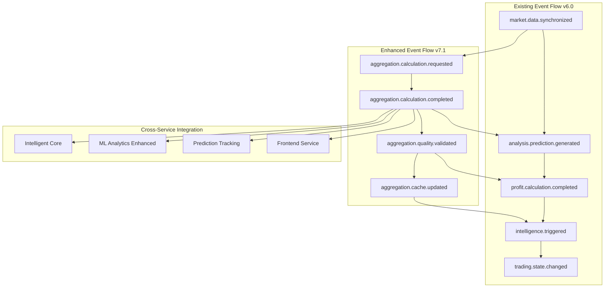

# 🔗 Integration Guide: Timeframe Aggregation v7.1

## 📋 **Overview**

**Zweck:** Vollständiger Integrationsleitfaden für die nahtlose Integration der Timeframe Aggregation Engine v7.1 in die bestehende Clean Architecture v6.0  
**Scope:** Event-Driven Trading Intelligence System mit 11 Services  
**Architektur:** Clean Architecture mit SOLID Principles Compliance  
**Hauptintegration:** Data Processing Service Enhanced (Port 8017)  

### **Integration Strategy**
- **Backward Compatibility**: Vollständige Kompatibilität mit bestehenden Services
- **Zero-Downtime Deployment**: Graduelle Integration ohne Service-Unterbrechung
- **Event-Driven Enhancement**: Erweiterte Event-Bus Integration
- **Performance Optimization**: Cache-Layer Integration für bessere Performance

---

## 🏗️ **Service Integration Matrix**

### **Primary Integration Points**

#### **1. Data Processing Service Enhanced (Port 8017) - HAUPTINTEGRATION**

**Integration Typ:** Core Extension  
**Impact Level:** HIGH  
**Integration Complexity:** Medium-High  

```python
# Bestehende Service-Struktur erweitern
data-processing-service-enhanced/
├── existing/
│   ├── csv_middleware/          # ✅ Bleibt unverändert
│   ├── data_sync/               # ✅ Bleibt unverändert  
│   ├── validation_pipeline/     # ✅ Bleibt unverändert
│   └── format_conversion/       # ✅ Bleibt unverändert
└── aggregation_extension/       # 🆕 Neue Aggregation Engine
    ├── domain/
    │   ├── entities/
    │   ├── value_objects/
    │   └── services/
    ├── application/
    │   ├── use_cases/
    │   ├── dtos/
    │   └── interfaces/
    ├── infrastructure/
    │   ├── persistence/
    │   ├── messaging/
    │   └── external/
    └── presentation/
        ├── controllers/
        └── models/
```

**Integration Steps:**
```bash
# Step 1: Extension Module Integration
1. Erstelle aggregation_extension/ Modul innerhalb bestehender Service-Struktur
2. Erweitere Service-Configuration um Aggregation-spezifische Settings
3. Integriere Aggregation Routes in bestehende FastAPI Application
4. Erweitere Service-Dependencies um Aggregation Components

# Step 2: Database Integration
1. Führe Database Migrations für neue Aggregation Tables durch
2. Erweitere bestehende Connection Pool um Aggregation Repository
3. Integriere Aggregation Indexes für Performance Optimization
4. Konfiguriere Materialized Views für High-Performance Queries

# Step 3: Event Bus Extension
1. Erweitere bestehende Event Publisher um 4 neue Aggregation Events
2. Konfiguriere Event Handlers für Cross-Service Integration
3. Erweitere Event Schema Registry um Aggregation Event Definitions
4. Integriere Event-Driven Quality Feedback Loop
```

**Configuration Changes:**
```yaml
# service_config.yml - Erweiterte Konfiguration
aggregation:
  enabled: true
  strategies:
    - weighted_average
    - median
    - ensemble
  quality_thresholds:
    minimum_quality_score: 0.8
    minimum_confidence_score: 0.6
  performance_targets:
    response_time_1w_ms: 150
    response_time_1m_ms: 300
    cache_hit_rate: 0.85
  cache:
    redis_enabled: true
    ttl_seconds: 3600
    key_prefix: "aggregation:"
```

#### **2. Event Bus Service (Port 8014) - EVENT INTEGRATION**

**Integration Typ:** Event Schema Extension  
**Impact Level:** MEDIUM  
**Integration Complexity:** Low-Medium  

```python
# Event Schema Extensions
event_schemas/
└── aggregation/
    ├── aggregation_calculation_requested.json    # 🆕
    ├── aggregation_calculation_completed.json    # 🆕
    ├── aggregation_quality_validated.json       # 🆕
    └── aggregation_cache_updated.json           # 🆕
```

**Integration Steps:**
```bash
# Step 1: Event Schema Registration
1. Registriere 4 neue Event-Types in Event Bus Service
2. Erweitere Event Validation um Aggregation-spezifische Schemas
3. Konfiguriere Event Routing für Cross-Service Distribution
4. Integriere Event Monitoring für Aggregation Events

# Step 2: Event Handler Integration
1. Erweitere bestehende Event Handlers um Aggregation Event Processing
2. Konfiguriere Event Dead Letter Queues für failed Aggregation Events
3. Integriere Event Replay Mechanism für Aggregation Event Recovery
4. Erweitere Event Performance Monitoring um Aggregation Metrics
```

#### **3. Frontend Service (Port 8080) - UI INTEGRATION**

**Integration Typ:** Dashboard Extension  
**Impact Level:** MEDIUM  
**Integration Complexity:** Medium  

```typescript
// Frontend Integration Components
frontend/src/
├── aggregation/                 # 🆕 Neue Aggregation UI Components
│   ├── components/
│   │   ├── AggregationDashboard.tsx
│   │   ├── QualityMetrics.tsx
│   │   ├── TimeframeSelector.tsx
│   │   └── AggregationChart.tsx
│   ├── services/
│   │   ├── AggregationService.ts
│   │   └── QualityService.ts
│   └── types/
│       ├── AggregationTypes.ts
│       └── QualityTypes.ts
└── integration/
    ├── EventListener.ts         # ✏️ Erweitert um Aggregation Events
    └── WebSocketService.ts      # ✏️ Erweitert um Real-time Aggregation Updates
```

**Integration Steps:**
```bash
# Step 1: UI Components Integration
1. Erstelle Aggregation Dashboard Components für neue KI-Prognosen Sektion
2. Erweitere bestehende Symbol-Detail Views um Aggregation Metrics
3. Integriere Real-time Updates über WebSocket für Aggregation Results
4. Erweitere Charting Components um Aggregation Visualization

# Step 2: API Client Extension
1. Erweitere API Client um Aggregation Endpoints
2. Konfiguriere Type Definitions für Aggregation DTOs
3. Integriere Error Handling für Aggregation-spezifische Errors
4. Erweitere Caching Strategy um Aggregation Results
```

#### **4. ML Analytics Service Enhanced (Port 8021) - MODEL INTEGRATION**

**Integration Typ:** Model Feedback Loop  
**Impact Level:** MEDIUM  
**Integration Complexity:** Medium  

**Integration Steps:**
```bash
# Step 1: Model Performance Integration
1. Erweitere Model Performance Tracking um Aggregation Quality Feedback
2. Integriere Aggregation Results in Model Training Pipeline
3. Konfiguriere Model Accuracy Validation basierend auf Aggregation Quality
4. Erweitere Cross-Validation mit Aggregation-based Quality Metrics

# Step 2: Data Pipeline Extension
1. Erweitere Data Pipeline um Aggregation Input Data
2. Konfiguriere Feature Engineering basierend auf Aggregation Insights
3. Integriere Aggregation-based Model Selection
4. Erweitere Model Monitoring um Aggregation Performance Correlation
```

### **Secondary Integration Points**

#### **5. Unified Profit Engine Enhanced (Port 8025) - PROFIT CALCULATION**

**Integration Changes:**
- Erweiterte SOLL-IST Berechnung basierend auf Aggregation Quality Scores
- Integration von Aggregation Confidence in Profit Forecasting
- Erweiterte Risk Assessment basierend auf Aggregation Variance

#### **6. Intelligent Core Service (Port 8022) - ANALYSIS INTEGRATION**

**Integration Changes:**
- Cross-System Analysis erweitert um Aggregation Pattern Recognition
- Quality-based Decision Making integriert in Intelligence Triggers
- Multi-region Correlation Analysis erweitert um Aggregation Insights

#### **7. Prediction Tracking Service (Port 8023) - PERFORMANCE TRACKING**

**Integration Changes:**
- Performance Monitoring erweitert um Aggregation Quality Tracking
- Accuracy Measurement basierend auf Aggregation vs. Actual Results
- Historical Performance Analysis um Aggregation Trends erweitert

---

## 📊 **Database Integration Strategy**

### **Schema Integration Plan**

#### **PostgreSQL Event Store Extensions**

```sql
-- Migration V7.1.001: Core Aggregation Tables
BEGIN;

-- Erweitere bestehende Event Store um Aggregation Tables
CREATE TABLE aggregated_predictions (
    id UUID PRIMARY KEY DEFAULT gen_random_uuid(),
    symbol VARCHAR(10) NOT NULL,
    company_name VARCHAR(255) NOT NULL,
    market_region VARCHAR(50) NOT NULL,
    timeframe_type VARCHAR(20) NOT NULL,
    timeframe_value INTEGER NOT NULL,
    timeframe_display VARCHAR(10) NOT NULL,
    horizon_days INTEGER NOT NULL,
    aggregation_date DATE NOT NULL,
    target_date DATE NOT NULL,
    predicted_value DECIMAL(15,6) NOT NULL,
    confidence_score DECIMAL(5,4) NOT NULL,
    quality_score DECIMAL(5,4) NOT NULL,
    data_points_count INTEGER NOT NULL,
    variance DECIMAL(15,8),
    standard_deviation DECIMAL(15,8),
    aggregation_strategy VARCHAR(50) NOT NULL,
    created_at TIMESTAMP WITH TIME ZONE DEFAULT CURRENT_TIMESTAMP,
    last_updated TIMESTAMP WITH TIME ZONE DEFAULT CURRENT_TIMESTAMP
);

-- Performance Indexes für Aggregation Tables
CREATE INDEX CONCURRENTLY idx_aggregated_predictions_symbol_timeframe 
ON aggregated_predictions (symbol, timeframe_display, aggregation_date DESC);

CREATE INDEX CONCURRENTLY idx_aggregated_predictions_quality_score 
ON aggregated_predictions (quality_score DESC, created_at DESC);

-- Integration mit bestehenden Views
CREATE MATERIALIZED VIEW aggregated_predictions_performance_unified AS
SELECT 
    ap.symbol as stock_symbol,
    ap.timeframe_display as timeframe,
    ap.predicted_value,
    ap.confidence_score,
    ap.quality_score,
    ap.data_points_count,
    ap.aggregation_strategy as strategy_used,
    ap.created_at as aggregation_timestamp,
    -- Integration mit bestehenden SOLL-IST Tracking
    soll.ist_gewinn as actual_profit,
    soll.soll_gewinn_1w as target_profit_1w,
    soll.soll_gewinn_1m as target_profit_1m
FROM aggregated_predictions ap
LEFT JOIN soll_ist_performance_unified soll 
    ON ap.symbol = soll.stock_symbol 
    AND ap.aggregation_date = soll.tracking_date
ORDER BY ap.created_at DESC;

COMMIT;
```

#### **Redis Cache Integration**

```python
# Cache Strategy für bestehende Redis Instance
class AggregationCacheIntegration:
    """
    Integration der Aggregation Cache Strategy in bestehende Redis Infrastructure
    """
    
    def __init__(self, existing_redis_client):
        self.redis = existing_redis_client
        self.cache_prefix = "aggregation:"
        self.default_ttl = 3600  # 1 hour
    
    async def integrate_with_existing_cache(self):
        """
        Integriert Aggregation Cache in bestehende Cache-Strategie
        """
        
        # Erweitere bestehende Cache Namespace Strategy
        cache_namespaces = {
            "market_data": "market:",      # Bestehend
            "predictions": "pred:",        # Bestehend  
            "analysis": "analysis:",       # Bestehend
            "aggregations": "aggregation:" # 🆕 Neu
        }
        
        # Cache Invalidation Strategy Integration
        await self._setup_cache_invalidation_integration()
        
        # Performance Monitoring Integration
        await self._integrate_cache_monitoring()
    
    async def _setup_cache_invalidation_integration(self):
        """
        Integriert Aggregation Cache Invalidation mit bestehenden Patterns
        """
        
        # Event-based Cache Invalidation
        invalidation_events = [
            "market.data.synchronized",     # Invalidate bei neuen Market Data
            "analysis.prediction.generated", # Invalidate bei neuen Predictions
            "profit.calculation.completed"   # Invalidate bei SOLL-IST Updates
        ]
        
        for event_type in invalidation_events:
            await self._register_cache_invalidation_handler(event_type)
```

---

## 🔄 **Event-Driven Integration**

### **Event Flow Integration Matrix**



### **Event Handler Integration**

```python
# Bestehende Event Handler erweitern
class EnhancedEventHandlerIntegration:
    """
    Integration von Aggregation Events in bestehende Event Handler
    """
    
    def __init__(self, existing_event_handlers):
        self.existing_handlers = existing_event_handlers
        self.aggregation_handlers = AggregationEventHandlers()
    
    async def integrate_aggregation_events(self):
        """
        Integriert Aggregation Event Handlers in bestehende Event Processing Pipeline
        """
        
        # Event Handler Chain Integration
        event_handler_chain = {
            # Bestehende Event Handlers
            "market.data.synchronized": [
                self.existing_handlers.handle_market_data,
                self.aggregation_handlers.trigger_aggregation_calculation  # 🆕
            ],
            
            "analysis.prediction.generated": [
                self.existing_handlers.handle_prediction_generated,
                self.aggregation_handlers.update_aggregation_input_data   # 🆕
            ],
            
            # Neue Aggregation Event Handlers
            "aggregation.calculation.completed": [
                self.aggregation_handlers.handle_aggregation_completed,
                self.existing_handlers.integrate_aggregation_results      # ✏️ Erweitert
            ],
            
            "aggregation.quality.validated": [
                self.aggregation_handlers.handle_quality_validation,
                self.existing_handlers.update_quality_metrics            # ✏️ Erweitert
            ]
        }
        
        return event_handler_chain
```

---

## 🚀 **Deployment Integration Strategy**

### **Zero-Downtime Integration Phases**

#### **Phase 1: Infrastructure Preparation (Tag 1)**

```bash
# Step 1.1: Database Schema Extension
# Führe Database Migrations ohne Service Impact durch
kubectl exec -it postgres-primary -- psql -U aktienanalyse -d trading_db -f /migrations/v7.1.001-aggregation-tables.sql

# Step 1.2: Redis Configuration Extension  
# Erweitere Redis Configuration um Aggregation Namespaces
kubectl patch configmap redis-config --patch '{"data":{"aggregation.conf":"maxmemory-policy allkeys-lru\nnamespace aggregation\nttl 3600"}}'

# Step 1.3: Event Schema Registration
# Registriere neue Event Schemas ohne bestehende Events zu beeinträchtigen
kubectl apply -f event-schemas/aggregation/
```

#### **Phase 2: Service Extension Deployment (Tag 2)**

```bash
# Step 2.1: Data Processing Service Extension
# Deploy Aggregation Extension Module ohne bestehende Funktionalität zu beeinträchtigen
kubectl set image deployment/data-processing-enhanced \
  data-processing=aktienanalyse/data-processing-enhanced:v7.1-aggregation

# Step 2.2: Feature Flag Activation
# Aktiviere Aggregation Features schrittweise mit Feature Flags
kubectl patch configmap data-processing-config --patch '{"data":{"aggregation_enabled":"true","aggregation_beta":"true"}}'

# Step 2.3: Health Check Validation
# Validiere dass alle bestehenden Services weiterhin funktionieren
kubectl get pods -l app=aktienanalyse --field-selector=status.phase=Running
```

#### **Phase 3: Event Integration Activation (Tag 3)**

```bash
# Step 3.1: Event Handler Integration
# Aktiviere Aggregation Event Handlers schrittweise
kubectl patch configmap event-bus-config --patch '{"data":{"aggregation_events_enabled":"true"}}'

# Step 3.2: Cross-Service Integration
# Aktiviere Cross-Service Event Publishing für Aggregation
for service in frontend ml-analytics intelligent-core prediction-tracking; do
  kubectl patch configmap ${service}-config --patch '{"data":{"aggregation_integration_enabled":"true"}}'
done

# Step 3.3: Monitoring Integration
# Aktiviere Aggregation Performance Monitoring
kubectl apply -f monitoring/aggregation-metrics.yaml
```

#### **Phase 4: Full Feature Activation (Tag 4)**

```bash
# Step 4.1: Remove Feature Flags
# Entferne Beta Feature Flags nach erfolgreicher Validation
kubectl patch configmap data-processing-config --patch '{"data":{"aggregation_beta":"false","aggregation_enabled":"true"}}'

# Step 4.2: Performance Optimization
# Aktiviere alle Performance Optimizations
kubectl patch configmap data-processing-config --patch '{"data":{"aggregation_cache_enabled":"true","aggregation_batch_enabled":"true"}}'

# Step 4.3: Full Integration Validation
# Führe End-to-End Integration Tests durch
kubectl apply -f testing/integration-tests-aggregation.yaml
```

### **Rollback Strategy**

```bash
# Emergency Rollback Procedure
# Schnelle Deaktivierung bei kritischen Issues

# Step 1: Disable New Features
kubectl patch configmap data-processing-config --patch '{"data":{"aggregation_enabled":"false"}}'

# Step 2: Stop Event Publishing  
kubectl patch configmap event-bus-config --patch '{"data":{"aggregation_events_enabled":"false"}}'

# Step 3: Rollback Service Version
kubectl rollout undo deployment/data-processing-enhanced

# Step 4: Validate System Recovery
kubectl get pods -l app=aktienanalyse --field-selector=status.phase=Running
```

---

## 📈 **Monitoring & Observability Integration**

### **Metrics Integration**

```python
# Erweiterte Metrics für bestehende Monitoring Infrastructure
class AggregationMetricsIntegration:
    """
    Integration von Aggregation Metrics in bestehende Monitoring Infrastructure
    """
    
    def __init__(self, existing_metrics_client):
        self.metrics = existing_metrics_client
    
    async def setup_aggregation_metrics(self):
        """
        Integriert Aggregation-spezifische Metrics in bestehende Monitoring
        """
        
        # Performance Metrics Integration
        performance_metrics = {
            "aggregation_response_time": {
                "type": "histogram",
                "help": "Response time for aggregation requests",
                "labels": ["timeframe", "symbol_count", "strategy"]
            },
            
            "aggregation_quality_score": {
                "type": "gauge", 
                "help": "Quality score distribution for aggregations",
                "labels": ["symbol", "timeframe", "strategy"]
            },
            
            "aggregation_cache_hit_rate": {
                "type": "gauge",
                "help": "Cache hit rate for aggregation requests", 
                "labels": ["timeframe"]
            },
            
            "aggregation_sla_compliance": {
                "type": "gauge",
                "help": "SLA compliance rate for aggregation operations",
                "labels": ["sla_type", "timeframe"]
            }
        }
        
        # Integriere Metrics in bestehende Prometheus Registry
        for metric_name, config in performance_metrics.items():
            await self.metrics.register_metric(metric_name, config)
```

### **Dashboard Integration**

```yaml
# Grafana Dashboard Integration für Aggregation Metrics
aggregation_dashboard_panels:
  - title: "Aggregation Response Times"
    targets:
      - expr: histogram_quantile(0.95, rate(aggregation_response_time_bucket[5m]))
        legendFormat: "95th percentile - {{timeframe}}"
    
  - title: "Quality Score Distribution"  
    targets:
      - expr: avg_over_time(aggregation_quality_score[1h])
        legendFormat: "Average Quality Score"
    
  - title: "Cache Performance"
    targets:
      - expr: rate(aggregation_cache_hit_rate[5m])
        legendFormat: "Cache Hit Rate"
    
  - title: "SLA Compliance"
    targets:
      - expr: aggregation_sla_compliance
        legendFormat: "{{sla_type}} - {{timeframe}}"
```

---

## 🔧 **Configuration Management**

### **Environment-Specific Configurations**

#### **Development Environment**
```yaml
# config/development.yml
aggregation:
  enabled: true
  debug_mode: true
  quality_thresholds:
    minimum_quality_score: 0.6  # Niedrigere Thresholds für Testing
    minimum_confidence_score: 0.5
  performance_targets:
    response_time_1w_ms: 200    # Relaxed für Development
    response_time_1m_ms: 400
  cache:
    enabled: false              # Kein Cache in Development
    ttl_seconds: 300
```

#### **Production Environment**
```yaml
# config/production.yml
aggregation:
  enabled: true
  debug_mode: false
  quality_thresholds:
    minimum_quality_score: 0.8  # Strikte Production Standards
    minimum_confidence_score: 0.6
  performance_targets:
    response_time_1w_ms: 150    # Strikte SLAs
    response_time_1m_ms: 300
  cache:
    enabled: true               # Vollständige Cache Strategy
    ttl_seconds: 3600
    compression: true
```

### **Feature Flag Management**

```python
# Feature Flag Configuration für schrittweise Integration
AGGREGATION_FEATURE_FLAGS = {
    "aggregation_enabled": {
        "development": True,
        "staging": True, 
        "production": False  # Initially disabled in production
    },
    
    "aggregation_batch_processing": {
        "development": True,
        "staging": True,
        "production": False  # Activate after core features are stable
    },
    
    "aggregation_advanced_quality": {
        "development": True,
        "staging": False,    # Test in development first
        "production": False
    },
    
    "aggregation_cross_service_events": {
        "development": True,
        "staging": True,
        "production": False  # Last feature to activate
    }
}
```

---

## ✅ **Integration Validation Checklist**

### **Pre-Integration Checks**
- [ ] Bestehende Services laufen stabil (>99% uptime letzte 7 Tage)
- [ ] Database Performance ist optimal (<50ms average query time)
- [ ] Event Bus läuft fehlerfrei (0 dead letter queue messages)
- [ ] Cache Hit Rates sind stabil (>80% für alle Services)
- [ ] Monitoring & Alerting funktioniert vollständig

### **Phase 1 Validation - Infrastructure**
- [ ] Database Migrations erfolgreich ausgeführt
- [ ] Neue Tables verfügbar und indiziert
- [ ] Redis Namespaces konfiguriert
- [ ] Event Schemas registriert ohne Konflikte
- [ ] Monitoring erweitert um Aggregation Metrics

### **Phase 2 Validation - Service Extension**
- [ ] Data Processing Service Enhanced deployed ohne Errors
- [ ] Bestehende API Endpoints funktionieren unverändert
- [ ] Neue Aggregation Endpoints verfügbar (mit Feature Flag)
- [ ] Health Checks bestehen für alle Services
- [ ] Logs zeigen keine neuen Error Patterns

### **Phase 3 Validation - Event Integration**
- [ ] Aggregation Events werden korrekt publiziert
- [ ] Cross-Service Event Handling funktioniert
- [ ] Event Dead Letter Queues bleiben leer
- [ ] Event Processing Performance im Zielbereich
- [ ] Bestehende Event Flows unbeeinträchtigt

### **Phase 4 Validation - Full Integration**
- [ ] End-to-End Aggregation Workflow funktioniert
- [ ] Performance SLAs werden eingehalten (<300ms/150ms)
- [ ] Quality Scores im Zielbereich (>80% über 0.8 quality)
- [ ] Cache Hit Rate >85% für Aggregation Requests
- [ ] Cross-Service Integration stabil

### **Post-Integration Monitoring**
- [ ] Performance Metrics stabil für 24h
- [ ] Error Rates unter 1% für alle Services
- [ ] Quality Metrics entsprechen Erwartungen
- [ ] User Experience unbeeinträchtigt
- [ ] System Capacity ausreichend für zusätzliche Last

---

*Integration Guide - Timeframe Aggregation v7.1*  
*Clean Architecture Integration - Zero-Downtime Service Extension*  
*Event-Driven Trading Intelligence System Enhancement*  
*Erstellt: 27. August 2025*