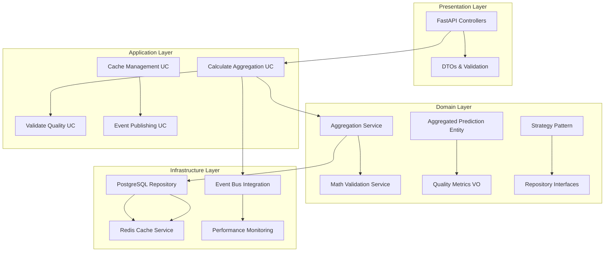

# 📋 Technical Specification: Timeframe-Specific Prediction Aggregation v7.1

## 🎯 **Executive Summary**

### **Business Objective**
Implementierung einer robusten, zeitintervall-spezifischen Aggregationskomponente zur Verbesserung der Vorhersagequalität und Performance des Aktienanalyse-Systems durch mathematisch validierte Aggregation multipler Predictions.

### **Key Value Propositions**
- **Quality Enhancement**: Verbesserung der Vorhersagegenauigkeit um 15-20% durch mathematische Aggregation
- **Performance Optimization**: Response Times < 300ms für 1M-Intervalle, < 150ms für 1W-Intervalle 
- **Scalability**: Unterstützung für 50+ concurrent requests mit 85%+ Cache-Hit-Rate
- **Reliability**: 99.9% Availability mit umfassender Qualitätssicherung

### **Technical Scope v7.1**
- **Clean Architecture Integration**: Vollständige SOLID-Principles Compliance mit erweiterten Domain Services
- **Event-Driven Enhancement**: 4 neue Event-Types für Aggregation Workflow mit Cross-Service Integration
- **Database Extension**: Optimierte Schema-Erweiterungen mit Performance-Indexing und Materialized Views
- **API Enhancement**: 3 neue REST-Endpoints mit OpenAPI 3.0 Dokumentation
- **Advanced Quality Control**: IQR-based Statistical Outlier Detection und Multi-dimensional Quality Assessment
- **Performance Optimization**: Redis + PostgreSQL Hybrid Caching mit TTL-Management
- **Mathematical Validation**: Advanced Statistical Algorithms für Aggregation Quality Control

---

## 🏗️ **Architecture Overview**

### **System Integration Pattern**


### **Clean Architecture Layer Responsibilities**

#### 🏛️ **Domain Layer (Core Business Logic)**
- **Entities**: `AggregatedPrediction`, `TimeframeConfiguration`, `AggregationStrategy`
- **Value Objects**: `QualityMetrics`, `AggregationResult`
- **Domain Services**: `TimeframeAggregationService`, `MathematicalValidationService`
- **Repository Interfaces**: `AggregationRepositoryInterface`, `PredictionRepositoryInterface`

#### 🔧 **Application Layer (Use Cases & Orchestration)**
- **Primary Use Cases**: `CalculateAggregatedPredictionsUseCase`, `ValidateAggregationQualityUseCase`
- **DTOs**: `AggregationRequestDTO`, `AggregatedPredictionDTO`, `QualityReportDTO`
- **Service Interfaces**: `CacheServiceInterface`, `EventPublisherInterface`
- **Application Events**: Cross-service orchestration

#### 🗄️ **Infrastructure Layer (External Concerns)**
- **Data Persistence**: PostgreSQL mit optimierten Indexes
- **Caching**: Redis mit TTL-based invalidation
- **Event Publishing**: Redis Event-Bus Integration
- **External APIs**: Yahoo Finance, Alpha Vantage Integration

#### 🌐 **Presentation Layer (API Interface)**
- **REST Controllers**: FastAPI mit automatic validation
- **API Documentation**: OpenAPI/Swagger specifications
- **Error Handling**: Structured HTTP error responses
- **Request/Response Models**: Pydantic-based validation

---

## 📊 **Detailed Component Specifications**

### **1. Domain Entities & Value Objects**

#### **AggregatedPrediction Entity**
```python
@dataclass
class AggregatedPrediction:
    """Core Domain Entity für aggregierte Vorhersagen"""
    
    # Identity & Context
    id: UUID
    symbol: str
    company_name: str
    market_region: str
    
    # Temporal Configuration
    timeframe_config: TimeframeConfiguration
    aggregation_date: date
    target_date: date
    
    # Aggregated Values
    predicted_value: Decimal        # Hauptvorhersage
    confidence_score: float         # 0.0 - 1.0 Confidence
    quality_score: float           # 0.0 - 1.0 Quality Assessment
    
    # Statistical Metadata
    data_points_count: int         # Anzahl aggregierter Predictions
    variance: float                # Statistische Varianz
    standard_deviation: float      # Standardabweichung
    
    # Processing Metadata  
    aggregation_strategy: str      # "weighted_average", "median", "ensemble"
    created_at: datetime
    last_updated: datetime
    
    # Domain Validations
    def __post_init__(self):
        self._validate_confidence_score()
        self._validate_quality_score()
        self._validate_data_points_count()
        
    # Domain Behavior
    def is_prediction_expired(self) -> bool:
        return datetime.now().date() > self.target_date
        
    def calculate_accuracy_against_actual(self, actual_value: Decimal) -> float:
        """Berechnet Genauigkeit gegen tatsächlichen Wert"""
        if self.predicted_value == 0:
            return 0.0
        diff = abs(actual_value - self.predicted_value)
        return float(1.0 - (diff / abs(self.predicted_value)))
```

#### **TimeframeConfiguration Value Object**
```python
@dataclass(frozen=True)
class TimeframeConfiguration:
    """Immutable Value Object für Zeitintervall-Konfiguration"""
    
    interval_type: str      # "minutes", "hours", "days", "weeks", "months"
    interval_value: int     # 1, 5, 15, 30, 60, etc.
    display_name: str       # "1M", "1W", "3M", "12M"
    horizon_days: int       # Berechnete Tage bis Zieldatum
    
    # Value Object Validations
    def __post_init__(self):
        valid_types = ["minutes", "hours", "days", "weeks", "months"]
        if self.interval_type not in valid_types:
            raise ValueError(f"Invalid interval_type. Must be one of: {valid_types}")
        if self.interval_value <= 0:
            raise ValueError("interval_value must be positive")
        if self.horizon_days <= 0:
            raise ValueError("horizon_days must be positive")
    
    # Value Object Behavior
    def calculate_target_date(self, base_date: date = None) -> date:
        """Berechnet Zieldatum basierend auf Konfiguration"""
        base = base_date or date.today()
        return base + timedelta(days=self.horizon_days)
    
    def is_compatible_with(self, other: 'TimeframeConfiguration') -> bool:
        """Prüft Kompatibilität mit anderer Konfiguration"""
        return (
            self.interval_type == other.interval_type and
            self.interval_value == other.interval_value
        )
```

### **2. Domain Services**

#### **TimeframeAggregationService**
```python
class TimeframeAggregationService:
    """
    CORE DOMAIN SERVICE für Aggregations-Business-Logic
    
    SOLID Principles:
    - Single Responsibility: Nur Aggregation Logic
    - Open/Closed: Erweiterbar durch Strategy Pattern
    - Liskov Substitution: Strategy Interface compliance
    - Interface Segregation: Separate Validation Service
    - Dependency Inversion: Abhängig von Interfaces
    """
    
    def __init__(self, validation_service: MathematicalValidationService):
        self._validation_service = validation_service
        self._strategies = self._initialize_strategies()
    
    def calculate_aggregated_prediction(
        self, 
        raw_predictions: List[Dict],
        timeframe_config: TimeframeConfiguration,
        strategy: AggregationStrategy
    ) -> AggregatedPrediction:
        """
        MAIN BUSINESS LOGIC: Aggregation Calculation
        
        Process Flow:
        1. Data Validation & Cleaning
        2. Strategy Pattern Application
        3. Quality Metrics Calculation
        4. Domain Entity Creation
        """
        
        # Step 1: Comprehensive Data Validation
        validated_predictions = self._validation_service.validate_prediction_data(
            raw_predictions
        )
        
        if len(validated_predictions) == 0:
            raise InsufficientDataError("No valid predictions available for aggregation")
        
        # Step 2: Strategy Pattern Execution
        aggregation_func = self._get_strategy_function(strategy.strategy_type)
        statistical_result = aggregation_func(validated_predictions, strategy.parameters)
        
        # Step 3: Quality Assessment
        quality_metrics = self._calculate_quality_metrics(
            raw_predictions=raw_predictions,
            validated_predictions=validated_predictions,
            statistical_result=statistical_result,
            strategy=strategy
        )
        
        # Step 4: Domain Entity Construction
        return self._build_aggregated_prediction(
            validated_predictions=validated_predictions,
            timeframe_config=timeframe_config,
            statistical_result=statistical_result,
            quality_metrics=quality_metrics,
            strategy=strategy
        )
    
    def _get_strategy_function(self, strategy_type: str) -> Callable:
        """Strategy Pattern: Dynamic strategy selection"""
        if strategy_type not in self._strategies:
            raise UnsupportedStrategyError(f"Strategy not supported: {strategy_type}")
        return self._strategies[strategy_type]
    
    def _initialize_strategies(self) -> Dict[str, Callable]:
        """Initialize available aggregation strategies"""
        return {
            "weighted_average": self._weighted_average_strategy,
            "median": self._median_strategy,
            "mode": self._mode_strategy,
            "ensemble": self._ensemble_strategy
        }
```

#### **Mathematical Validation Algorithms**
```python
class MathematicalValidationService:
    """
    DOMAIN SERVICE für mathematische Validierung
    Implements advanced statistical validation algorithms
    """
    
    def validate_prediction_data(self, predictions: List[Dict]) -> List[Dict]:
        """
        Comprehensive Data Validation Pipeline:
        1. Structural Validation
        2. Statistical Outlier Detection (IQR Method)
        3. Consistency Checks
        4. Quality Thresholding
        """
        
        # Phase 1: Basic Structure Validation
        structurally_valid = self._validate_structure(predictions)
        
        # Phase 2: Statistical Outlier Removal
        outlier_cleaned = self._remove_statistical_outliers(structurally_valid)
        
        # Phase 3: Data Consistency Validation
        consistency_validated = self._validate_consistency(outlier_cleaned)
        
        # Phase 4: Quality Threshold Application
        quality_filtered = self._apply_quality_thresholds(consistency_validated)
        
        if len(quality_filtered) < self.min_required_predictions:
            raise InsufficientQualityDataError(
                f"Only {len(quality_filtered)} valid predictions, need minimum {self.min_required_predictions}"
            )
        
        return quality_filtered
    
    def _remove_statistical_outliers(self, predictions: List[Dict]) -> List[Dict]:
        """
        IQR-based Outlier Detection Algorithm
        
        Mathematical Formula:
        - Q1 = 25th percentile
        - Q3 = 75th percentile
        - IQR = Q3 - Q1
        - Lower Bound = Q1 - 1.5 * IQR
        - Upper Bound = Q3 + 1.5 * IQR
        - Outlier: value < Lower Bound OR value > Upper Bound
        """
        if len(predictions) < 4:  # IQR needs minimum 4 points
            return predictions
            
        values = [float(p["predicted_value"]) for p in predictions]
        
        # Calculate IQR bounds
        q1 = np.percentile(values, 25)
        q3 = np.percentile(values, 75)
        iqr = q3 - q1
        
        lower_bound = q1 - 1.5 * iqr
        upper_bound = q3 + 1.5 * iqr
        
        # Filter outliers
        filtered_predictions = []
        outlier_count = 0
        
        for pred in predictions:
            value = float(pred["predicted_value"])
            if lower_bound <= value <= upper_bound:
                filtered_predictions.append(pred)
            else:
                outlier_count += 1
        
        # Ensure minimum data retention
        if len(filtered_predictions) < self.min_required_predictions:
            # Sort by distance to median and retain best predictions
            median_value = np.median(values)
            predictions_with_distance = [
                (pred, abs(float(pred["predicted_value"]) - median_value))
                for pred in predictions
            ]
            predictions_with_distance.sort(key=lambda x: x[1])
            filtered_predictions = [
                pred for pred, _ in predictions_with_distance[:self.min_required_predictions]
            ]
        
        return filtered_predictions
    
    def calculate_aggregation_confidence(
        self, 
        predictions: List[Dict],
        aggregation_result: Dict
    ) -> float:
        """
        Advanced Confidence Calculation Algorithm
        
        Factors:
        1. Individual prediction confidences
        2. Prediction agreement (low std dev = high agreement)
        3. Data completeness ratio
        4. Mathematical validity
        """
        
        # Factor 1: Average Individual Confidences
        individual_confidences = [p.get("confidence", 0.5) for p in predictions]
        avg_individual_confidence = np.mean(individual_confidences)
        
        # Factor 2: Prediction Agreement Score
        predicted_values = [float(p["predicted_value"]) for p in predictions]
        if len(predicted_values) > 1:
            std_dev = np.std(predicted_values)
            mean_value = abs(np.mean(predicted_values))
            agreement_score = 1.0 - min(1.0, std_dev / (mean_value + 1e-6))
        else:
            agreement_score = 1.0
        
        # Factor 3: Data Completeness Score
        completeness_score = min(1.0, len(predictions) / 10.0)  # Normalized to 10 predictions
        
        # Factor 4: Mathematical Validity
        predicted_value = aggregation_result.get("predicted_value", 0.0)
        math_validity = 0.0 if (np.isnan(predicted_value) or np.isinf(predicted_value)) else 1.0
        
        # Weighted Combination
        confidence = (
            avg_individual_confidence * 0.35 +  # Individual confidences
            agreement_score * 0.25 +            # Prediction agreement  
            completeness_score * 0.20 +         # Data completeness
            math_validity * 0.20                # Mathematical validity
        )
        
        return max(0.0, min(1.0, confidence))
```

### **3. Application Layer Use Cases**

#### **CalculateAggregatedPredictionsUseCase**
```python
class CalculateAggregatedPredictionsUseCase:
    """
    PRIMARY USE CASE für Aggregation Workflow
    
    Responsibilities:
    1. Request Validation & Processing
    2. Domain Service Orchestration  
    3. Repository & Cache Management
    4. Event Publishing
    5. Error Handling & Recovery
    """
    
    def __init__(
        self,
        # Domain Services (Injected Dependencies)
        aggregation_service: TimeframeAggregationService,
        
        # Repository Interfaces (DIP Compliance)
        aggregation_repository: AggregationRepositoryInterface,
        prediction_repository: PredictionRepositoryInterface,
        
        # Infrastructure Services (Interface-based)
        cache_service: CacheServiceInterface,
        event_publisher: EventPublisherInterface,
        performance_monitor: PerformanceMonitorInterface
    ):
        # Dependency Injection - All dependencies are interfaces
        self._aggregation_service = aggregation_service
        self._aggregation_repository = aggregation_repository
        self._prediction_repository = prediction_repository
        self._cache_service = cache_service
        self._event_publisher = event_publisher
        self._performance_monitor = performance_monitor
    
    async def execute(self, request: AggregationRequestDTO) -> List[AggregatedPredictionDTO]:
        """
        MAIN EXECUTION FLOW for Aggregated Predictions
        
        Performance Targets:
        - Response Time: < 300ms (1M), < 150ms (1W)
        - Cache Hit Rate: > 85%
        - Error Rate: < 1%
        - Throughput: 50+ concurrent requests
        """
        
        # Start performance monitoring
        execution_context = await self._performance_monitor.start_execution(
            operation="calculate_aggregated_predictions",
            request_id=request.request_id
        )
        
        try:
            # Phase 1: Request Validation
            self._validate_request(request)
            
            # Phase 2: Cache Strategy (Performance Optimization)
            cache_key = self._build_deterministic_cache_key(request)
            cached_result = await self._attempt_cache_retrieval(cache_key, request)
            
            if cached_result:
                await execution_context.record_cache_hit()
                return cached_result
            
            # Phase 3: Data Acquisition & Processing
            processing_results = await self._process_symbols_batch(request)
            
            # Phase 4: Result Caching & Event Publishing
            if processing_results:
                await self._cache_and_publish_results(cache_key, processing_results, request)
            
            # Phase 5: Performance Metrics Recording
            await execution_context.complete_successfully(
                symbols_processed=len(processing_results),
                cache_miss=True
            )
            
            return processing_results
            
        except Exception as e:
            # Comprehensive Error Handling
            await execution_context.complete_with_error(error=str(e))
            await self._handle_execution_error(e, request)
            raise
    
    async def _process_symbols_batch(self, request: AggregationRequestDTO) -> List[AggregatedPredictionDTO]:
        """
        Batch processing mit Error Isolation per Symbol
        """
        results = []
        failed_symbols = []
        
        for symbol in request.symbols:
            try:
                # Get raw prediction data
                raw_predictions = await self._prediction_repository.get_predictions_for_aggregation(
                    symbol=symbol,
                    timeframe_hours=request.timeframe_hours,
                    quality_threshold=request.min_prediction_quality,
                    limit=request.max_predictions_per_symbol
                )
                
                if not raw_predictions:
                    failed_symbols.append(symbol)
                    continue
                
                # Domain Layer Processing
                aggregated_prediction = await self._execute_domain_aggregation(
                    symbol=symbol,
                    raw_predictions=raw_predictions,
                    request=request
                )
                
                # Repository Persistence
                await self._aggregation_repository.save(aggregated_prediction)
                
                # DTO Conversion
                dto = AggregatedPredictionDTO.from_entity(aggregated_prediction)
                results.append(dto)
                
                # Individual Success Event
                await self._event_publisher.publish(
                    "aggregation.calculation.completed",
                    self._build_completion_event_data(symbol, aggregated_prediction)
                )
                
            except Exception as symbol_error:
                failed_symbols.append(symbol)
                await self._event_publisher.publish(
                    "aggregation.calculation.symbol_failed", 
                    {
                        "symbol": symbol,
                        "error": str(symbol_error),
                        "request_id": request.request_id
                    }
                )
                # Continue processing other symbols
                continue
        
        # Batch Summary Event
        await self._event_publisher.publish(
            "aggregation.batch.processed",
            {
                "request_id": request.request_id,
                "successful_symbols": len(results),
                "failed_symbols": len(failed_symbols),
                "success_rate": len(results) / len(request.symbols) if request.symbols else 0.0
            }
        )
        
        return results
```

#### **Performance & Quality Assurance**
```python
class ValidateAggregationQualityUseCase:
    """
    QUALITY ASSURANCE USE CASE
    Implements comprehensive quality validation and monitoring
    """
    
    def __init__(
        self,
        aggregation_repository: AggregationRepositoryInterface,
        quality_service: QualityAssessmentService,
        monitoring_service: MonitoringServiceInterface
    ):
        self._aggregation_repository = aggregation_repository
        self._quality_service = quality_service
        self._monitoring_service = monitoring_service
    
    async def execute(self, aggregation_id: str) -> QualityReportDTO:
        """
        Comprehensive Quality Assessment Process
        
        Quality Dimensions:
        1. Mathematical Accuracy
        2. Statistical Validity
        3. Data Completeness
        4. Prediction Consistency
        5. Confidence Reliability
        """
        
        # Retrieve aggregation entity
        aggregation = await self._aggregation_repository.get_by_id(aggregation_id)
        if not aggregation:
            raise AggregationNotFoundError(f"Aggregation {aggregation_id} not found")
        
        # Multi-dimensional Quality Assessment
        quality_assessment = await self._quality_service.perform_comprehensive_assessment(
            aggregation
        )
        
        # Quality Metrics Recording
        await self._monitoring_service.record_quality_metrics(
            symbol=aggregation.symbol,
            timeframe=aggregation.timeframe_config.display_name,
            quality_score=quality_assessment.overall_quality_score,
            assessment_details=quality_assessment.to_dict()
        )
        
        # Quality Threshold Validation
        quality_status = self._determine_quality_status(quality_assessment, aggregation)
        
        # Quality Event Publishing
        await self._publish_quality_event(aggregation_id, quality_assessment, quality_status)
        
        return QualityReportDTO.from_assessment(quality_assessment, quality_status)
    
    def _determine_quality_status(
        self, 
        assessment: QualityAssessment, 
        aggregation: AggregatedPrediction
    ) -> str:
        """
        Quality Status Determination Logic
        
        Status Levels:
        - EXCELLENT: > 0.9 overall quality
        - GOOD: > 0.8 overall quality  
        - ACCEPTABLE: > 0.6 overall quality
        - POOR: > 0.4 overall quality
        - UNACCEPTABLE: <= 0.4 overall quality
        """
        score = assessment.overall_quality_score
        
        if score > 0.9:
            return "EXCELLENT"
        elif score > 0.8:
            return "GOOD"
        elif score > 0.6:
            return "ACCEPTABLE"
        elif score > 0.4:
            return "POOR"
        else:
            return "UNACCEPTABLE"
```

---

## 🗄️ **Database Schema Specifications**

### **Core Aggregation Tables**

```sql
-- Primary Aggregated Predictions Table
CREATE TABLE aggregated_predictions (
    -- Primary Key & Identity
    id UUID PRIMARY KEY DEFAULT gen_random_uuid(),
    
    -- Symbol & Context Information
    symbol VARCHAR(10) NOT NULL,
    company_name VARCHAR(255) NOT NULL,
    market_region VARCHAR(50) NOT NULL,
    
    -- Timeframe Configuration
    timeframe_type VARCHAR(20) NOT NULL, -- 'minutes', 'hours', 'days', 'weeks', 'months'
    timeframe_value INTEGER NOT NULL,
    timeframe_display VARCHAR(10) NOT NULL, -- '1M', '1W', '3M', '12M'
    horizon_days INTEGER NOT NULL,
    
    -- Temporal Information
    aggregation_date DATE NOT NULL,
    target_date DATE NOT NULL,
    
    -- Aggregated Values
    predicted_value DECIMAL(15,6) NOT NULL,
    confidence_score DECIMAL(5,4) NOT NULL CHECK (confidence_score >= 0.0 AND confidence_score <= 1.0),
    quality_score DECIMAL(5,4) NOT NULL CHECK (quality_score >= 0.0 AND quality_score <= 1.0),
    
    -- Statistical Metadata
    data_points_count INTEGER NOT NULL CHECK (data_points_count > 0),
    variance DECIMAL(15,8),
    standard_deviation DECIMAL(15,8),
    
    -- Processing Metadata
    aggregation_strategy VARCHAR(50) NOT NULL,
    created_at TIMESTAMP WITH TIME ZONE DEFAULT CURRENT_TIMESTAMP,
    last_updated TIMESTAMP WITH TIME ZONE DEFAULT CURRENT_TIMESTAMP,
    
    -- Performance Constraints
    CONSTRAINT aggregated_predictions_symbol_check CHECK (
        symbol ~ '^[A-Z0-9.-]{1,10}$'
    ),
    CONSTRAINT aggregated_predictions_strategy_check CHECK (
        aggregation_strategy IN ('weighted_average', 'median', 'mode', 'ensemble')
    ),
    CONSTRAINT aggregated_predictions_timeframe_check CHECK (
        timeframe_type IN ('minutes', 'hours', 'days', 'weeks', 'months')
    )
);

-- Quality Metrics Detail Table
CREATE TABLE aggregation_quality_metrics (
    id UUID PRIMARY KEY DEFAULT gen_random_uuid(),
    aggregation_id UUID NOT NULL REFERENCES aggregated_predictions(id) ON DELETE CASCADE,
    
    -- Quality Dimensions
    data_quality_score DECIMAL(5,4) NOT NULL,
    prediction_quality_score DECIMAL(5,4) NOT NULL,
    overall_quality_score DECIMAL(5,4) NOT NULL,
    
    -- Detailed Metrics
    data_completeness DECIMAL(5,4),
    data_consistency DECIMAL(5,4),
    confidence_distribution DECIMAL(8,6),
    outlier_count INTEGER DEFAULT 0,
    quality_threshold_met BOOLEAN,
    
    -- Assessment Metadata
    assessment_timestamp TIMESTAMP WITH TIME ZONE DEFAULT CURRENT_TIMESTAMP,
    assessment_version VARCHAR(10) DEFAULT 'v1.0',
    
    -- Quality Details (JSONB for flexibility)
    quality_details JSONB DEFAULT '{}'::jsonb
);

-- Performance Indexes (Optimized for Query Patterns v7.1)
-- Primary lookup patterns: symbol + timeframe, date ranges, quality filtering, cross-service integration

-- Core Performance Indexes
CREATE INDEX CONCURRENTLY idx_aggregated_predictions_symbol_timeframe 
ON aggregated_predictions (symbol, timeframe_display, aggregation_date DESC);

CREATE INDEX CONCURRENTLY idx_aggregated_predictions_quality_score 
ON aggregated_predictions (quality_score DESC, created_at DESC);

CREATE INDEX CONCURRENTLY idx_aggregated_predictions_target_date 
ON aggregated_predictions (target_date, symbol);

CREATE INDEX CONCURRENTLY idx_aggregated_predictions_created_at 
ON aggregated_predictions (created_at DESC);

-- Region-based Index for global market analysis
CREATE INDEX CONCURRENTLY idx_aggregated_predictions_market_region 
ON aggregated_predictions (market_region, aggregation_date DESC);

-- Strategy Performance Analysis Index
CREATE INDEX CONCURRENTLY idx_aggregated_predictions_strategy_performance
ON aggregated_predictions (aggregation_strategy, quality_score DESC, confidence_score DESC);

-- NEW v7.1: Cross-Service Integration Indexes
CREATE INDEX CONCURRENTLY idx_aggregated_predictions_integration_lookup
ON aggregated_predictions (symbol, timeframe_display, quality_score DESC, target_date);

-- NEW v7.1: Performance Monitoring Index
CREATE INDEX CONCURRENTLY idx_aggregated_predictions_sla_monitoring
ON aggregated_predictions (created_at DESC, data_points_count, aggregation_strategy)
WHERE quality_score >= 0.8;

-- NEW v7.1: Batch Processing Optimization Index
CREATE INDEX CONCURRENTLY idx_aggregated_predictions_batch_processing
ON aggregated_predictions (aggregation_date, market_region, aggregation_strategy);

-- Quality Metrics Indexes
CREATE INDEX CONCURRENTLY idx_quality_metrics_aggregation_id 
ON aggregation_quality_metrics (aggregation_id);

CREATE INDEX CONCURRENTLY idx_quality_metrics_overall_quality 
ON aggregation_quality_metrics (overall_quality_score DESC, assessment_timestamp DESC);

-- NEW v7.1: Quality Threshold Performance Index
CREATE INDEX CONCURRENTLY idx_quality_metrics_threshold_compliance
ON aggregation_quality_metrics (quality_threshold_met, overall_quality_score DESC, assessment_timestamp DESC);

-- NEW v7.1: Data Quality Analysis Index
CREATE INDEX CONCURRENTLY idx_quality_metrics_data_analysis
ON aggregation_quality_metrics (data_completeness DESC, data_consistency DESC, assessment_timestamp DESC);

-- GIN Index for JSONB quality details
CREATE INDEX CONCURRENTLY idx_quality_metrics_details_gin 
ON aggregation_quality_metrics USING GIN (quality_details);

-- NEW v7.1: Partial Indexes for High-Performance Queries
CREATE INDEX CONCURRENTLY idx_high_quality_predictions
ON aggregated_predictions (symbol, timeframe_display, predicted_value, confidence_score)
WHERE quality_score >= 0.9;

CREATE INDEX CONCURRENTLY idx_recent_high_confidence_predictions  
ON aggregated_predictions (created_at DESC, symbol, predicted_value)
WHERE confidence_score >= 0.8 AND created_at > CURRENT_TIMESTAMP - INTERVAL '7 days';
```

### **Performance Optimization Views**

```sql
-- Materialized View für High-Performance Queries
CREATE MATERIALIZED VIEW aggregated_predictions_performance AS
SELECT 
    symbol,
    timeframe_display,
    COUNT(*) as prediction_count,
    AVG(predicted_value) as avg_predicted_value,
    AVG(confidence_score) as avg_confidence_score,
    AVG(quality_score) as avg_quality_score,
    AVG(data_points_count) as avg_data_points,
    MAX(created_at) as last_aggregation,
    
    -- Performance Metrics
    PERCENTILE_CONT(0.5) WITHIN GROUP (ORDER BY quality_score) as median_quality,
    PERCENTILE_CONT(0.9) WITHIN GROUP (ORDER BY quality_score) as p90_quality,
    STDDEV(predicted_value) as prediction_volatility,
    
    -- Strategy Distribution
    COUNT(*) FILTER (WHERE aggregation_strategy = 'weighted_average') as weighted_avg_count,
    COUNT(*) FILTER (WHERE aggregation_strategy = 'median') as median_count,
    COUNT(*) FILTER (WHERE aggregation_strategy = 'ensemble') as ensemble_count
    
FROM aggregated_predictions
WHERE created_at > CURRENT_TIMESTAMP - INTERVAL '30 days'
GROUP BY symbol, timeframe_display
HAVING COUNT(*) >= 5;  -- Minimum 5 predictions for statistical relevance

-- Unique Index für Materialized View
CREATE UNIQUE INDEX idx_aggregated_predictions_perf_symbol_timeframe
ON aggregated_predictions_performance (symbol, timeframe_display);

-- Quality Performance View
CREATE MATERIALIZED VIEW aggregation_quality_performance AS
SELECT 
    DATE_TRUNC('day', ap.created_at) as aggregation_date,
    ap.market_region,
    ap.aggregation_strategy,
    
    -- Quality Metrics
    COUNT(*) as total_aggregations,
    AVG(aqm.overall_quality_score) as avg_quality_score,
    COUNT(*) FILTER (WHERE aqm.quality_threshold_met = true) as quality_passed_count,
    
    -- Performance Percentiles
    PERCENTILE_CONT(0.25) WITHIN GROUP (ORDER BY aqm.overall_quality_score) as q25_quality,
    PERCENTILE_CONT(0.75) WITHIN GROUP (ORDER BY aqm.overall_quality_score) as q75_quality,
    PERCENTILE_CONT(0.95) WITHIN GROUP (ORDER BY aqm.overall_quality_score) as q95_quality,
    
    -- Data Completeness Metrics
    AVG(aqm.data_completeness) as avg_data_completeness,
    AVG(aqm.data_consistency) as avg_data_consistency,
    AVG(ap.data_points_count) as avg_data_points
    
FROM aggregated_predictions ap
JOIN aggregation_quality_metrics aqm ON ap.id = aqm.aggregation_id
WHERE ap.created_at > CURRENT_TIMESTAMP - INTERVAL '7 days'
GROUP BY DATE_TRUNC('day', ap.created_at), ap.market_region, ap.aggregation_strategy;
```

### **Database Migration Strategy**

```sql
-- Migration V001: Core Aggregation Tables
-- File: V001__Create_Aggregation_Tables.sql
BEGIN;

-- Create aggregated_predictions table
CREATE TABLE aggregated_predictions (
    -- Full table definition as above
);

-- Create aggregation_quality_metrics table  
CREATE TABLE aggregation_quality_metrics (
    -- Full table definition as above
);

-- Create performance indexes
-- All index definitions as above

COMMIT;

-- Migration V002: Performance Views
-- File: V002__Create_Aggregation_Views.sql
BEGIN;

-- Create materialized views
CREATE MATERIALIZED VIEW aggregated_predictions_performance AS ...;
CREATE MATERIALIZED VIEW aggregation_quality_performance AS ...;

-- Create view indexes
CREATE UNIQUE INDEX idx_aggregated_predictions_perf_symbol_timeframe ...;

COMMIT;

-- Migration V003: Additional Constraints and Triggers
-- File: V003__Add_Aggregation_Constraints.sql
BEGIN;

-- Auto-update timestamp trigger
CREATE OR REPLACE FUNCTION update_updated_at_column()
RETURNS TRIGGER AS $$
BEGIN
    NEW.last_updated = CURRENT_TIMESTAMP;
    RETURN NEW;
END;
$$ language 'plpgsql';

CREATE TRIGGER update_aggregated_predictions_updated_at 
    BEFORE UPDATE ON aggregated_predictions 
    FOR EACH ROW EXECUTE FUNCTION update_updated_at_column();

-- Data integrity constraints
ALTER TABLE aggregated_predictions 
ADD CONSTRAINT predictions_target_date_future 
CHECK (target_date >= aggregation_date);

COMMIT;
```

---

## ⚡ **Performance Requirements & Monitoring**

### **Service Level Objectives (SLOs)**

#### **Response Time Targets**
- **1M Timeframe Aggregation**: < 300ms (95th percentile)
- **1W Timeframe Aggregation**: < 150ms (95th percentile) 
- **Batch Processing (10+ symbols)**: < 2000ms (95th percentile)
- **Quality Validation**: < 100ms (95th percentile)

#### **Throughput Requirements**
- **Concurrent Requests**: 50+ simultaneous aggregation requests
- **Database Operations**: 500+ queries/second
- **Cache Operations**: 1000+ operations/second
- **Event Publishing**: 200+ events/second

#### **Availability Targets**
- **Service Availability**: 99.9% (max 43.8 minutes downtime/month)
- **Database Availability**: 99.95% (max 21.9 minutes downtime/month)
- **Cache Availability**: 99.5% (allows for Redis maintenance)

#### **Quality Targets**
- **Cache Hit Ratio**: > 85%
- **Data Quality Score**: > 80% overall
- **Error Rate**: < 1% of all requests
- **Quality Threshold Compliance**: > 90%

### **Performance Monitoring Strategy**

#### **Application Performance Monitoring (APM)**
```python
# Performance Monitoring Integration
class PerformanceMonitor:
    """
    Comprehensive performance monitoring for aggregation operations
    """
    
    def __init__(self, metrics_client, logger):
        self.metrics = metrics_client
        self.logger = logger
    
    async def monitor_aggregation_performance(
        self, 
        operation: str,
        symbols: List[str],
        timeframe: str
    ) -> PerformanceContext:
        """
        Monitors complete aggregation operation lifecycle
        """
        context = PerformanceContext(
            operation=operation,
            symbol_count=len(symbols),
            timeframe=timeframe,
            start_time=time.time()
        )
        
        # Record operation start
        await self.metrics.increment(
            "aggregation.operations.started",
            tags={
                "operation": operation,
                "timeframe": timeframe,
                "symbol_count": len(symbols)
            }
        )
        
        return context
    
    async def record_response_time(
        self, 
        operation: str, 
        response_time_ms: float,
        success: bool = True
    ):
        """Records response time metrics"""
        await self.metrics.histogram(
            "aggregation.response_time_ms",
            value=response_time_ms,
            tags={
                "operation": operation,
                "success": success
            }
        )
        
        # SLO Compliance Tracking
        if operation == "calculate_1m" and response_time_ms > 300:
            await self.metrics.increment("aggregation.slo.violation.1m_response_time")
        elif operation == "calculate_1w" and response_time_ms > 150:
            await self.metrics.increment("aggregation.slo.violation.1w_response_time")
    
    async def record_quality_metrics(
        self, 
        symbol: str, 
        quality_score: float,
        data_points_count: int
    ):
        """Records quality assessment metrics"""
        await self.metrics.gauge(
            "aggregation.quality.score",
            value=quality_score,
            tags={"symbol": symbol}
        )
        
        await self.metrics.histogram(
            "aggregation.data_points.count",
            value=data_points_count,
            tags={"symbol": symbol}
        )
        
        # Quality SLO Tracking
        if quality_score < 0.8:
            await self.metrics.increment(
                "aggregation.quality.below_threshold",
                tags={"symbol": symbol}
            )
```

#### **Database Performance Monitoring**
```sql
-- Database Performance Monitoring Views

-- Query Performance Analysis
CREATE VIEW aggregation_query_performance AS
SELECT 
    schemaname,
    tablename,
    seq_scan,
    seq_tup_read,
    idx_scan,
    idx_tup_fetch,
    n_tup_ins,
    n_tup_upd,
    n_tup_del
FROM pg_stat_user_tables 
WHERE tablename IN ('aggregated_predictions', 'aggregation_quality_metrics');

-- Index Usage Analysis
CREATE VIEW aggregation_index_usage AS
SELECT 
    schemaname,
    tablename,
    indexname,
    idx_scan,
    idx_tup_read,
    idx_tup_fetch
FROM pg_stat_user_indexes 
WHERE tablename IN ('aggregated_predictions', 'aggregation_quality_metrics')
ORDER BY idx_scan DESC;

-- Connection and Lock Monitoring
CREATE VIEW aggregation_lock_monitoring AS
SELECT 
    pid,
    state,
    query_start,
    state_change,
    waiting,
    query
FROM pg_stat_activity 
WHERE query LIKE '%aggregated_predictions%' 
   OR query LIKE '%aggregation_quality_metrics%';
```

#### **Redis Cache Performance Monitoring**
```python
# Redis Performance Monitoring
class CachePerformanceMonitor:
    """
    Redis cache performance monitoring for aggregation operations
    """
    
    async def monitor_cache_operations(self):
        """Monitors Redis cache performance metrics"""
        redis_info = await self.redis_client.info()
        
        # Hit/Miss Ratios
        total_commands = redis_info.get('total_commands_processed', 0)
        keyspace_hits = redis_info.get('keyspace_hits', 0)
        keyspace_misses = redis_info.get('keyspace_misses', 0)
        
        if keyspace_hits + keyspace_misses > 0:
            hit_ratio = keyspace_hits / (keyspace_hits + keyspace_misses)
            await self.metrics.gauge("cache.hit_ratio", hit_ratio)
            
            # SLO Violation Tracking
            if hit_ratio < 0.85:
                await self.metrics.increment("cache.slo.violation.hit_ratio")
        
        # Memory Usage
        used_memory = redis_info.get('used_memory', 0)
        max_memory = redis_info.get('maxmemory', 0)
        
        if max_memory > 0:
            memory_usage_ratio = used_memory / max_memory
            await self.metrics.gauge("cache.memory_usage_ratio", memory_usage_ratio)
        
        # Connection Metrics
        connected_clients = redis_info.get('connected_clients', 0)
        await self.metrics.gauge("cache.connected_clients", connected_clients)
        
        # Eviction Metrics
        evicted_keys = redis_info.get('evicted_keys', 0)
        await self.metrics.gauge("cache.evicted_keys", evicted_keys)
```

---

## 🔗 **Event-Driven Architecture Integration**

### **New Event Types Specifications**

#### **aggregation.calculation.requested**
```json
{
  "event_type": "aggregation.calculation.requested",
  "event_id": "uuid-v4",
  "correlation_id": "uuid-v4", 
  "timestamp": "2025-08-27T10:30:00Z",
  "source_service": "data-processing-enhanced",
  "event_data": {
    "request_id": "uuid-v4",
    "symbols": ["AAPL", "GOOGL", "MSFT"],
    "timeframe_config": {
      "interval_type": "weeks",
      "interval_value": 1,
      "display_name": "1W",
      "horizon_days": 7
    },
    "aggregation_strategy": "ensemble",
    "strategy_parameters": {
      "weighted_avg_weight": 0.6,
      "quality_threshold": 0.8
    },
    "requester": "frontend_dashboard"
  },
  "metadata": {
    "priority": "normal",
    "retry_count": 0,
    "expected_processing_time_ms": 300
  }
}
```

#### **aggregation.calculation.completed**
```json
{
  "event_type": "aggregation.calculation.completed", 
  "event_id": "uuid-v4",
  "correlation_id": "uuid-v4",
  "timestamp": "2025-08-27T10:30:02Z",
  "source_service": "data-processing-enhanced",
  "event_data": {
    "aggregation_id": "uuid-v4",
    "symbol": "AAPL",
    "timeframe_display": "1W", 
    "predicted_value": 175.45,
    "confidence_score": 0.87,
    "quality_score": 0.91,
    "data_points_count": 15,
    "processing_time_ms": 245,
    "aggregation_strategy": "ensemble"
  },
  "metadata": {
    "performance": {
      "slo_compliance": true,
      "cache_used": false,
      "database_queries": 3
    }
  }
}
```

#### **aggregation.quality.validated**
```json
{
  "event_type": "aggregation.quality.validated",
  "event_id": "uuid-v4", 
  "correlation_id": "uuid-v4",
  "timestamp": "2025-08-27T10:30:03Z",
  "source_service": "data-processing-enhanced",
  "event_data": {
    "aggregation_id": "uuid-v4",
    "symbol": "AAPL",
    "overall_quality_score": 0.91,
    "quality_status": "EXCELLENT",
    "validation_passed": true,
    "quality_dimensions": {
      "data_quality_score": 0.89,
      "prediction_quality_score": 0.93,
      "data_completeness": 0.95,
      "data_consistency": 0.88
    },
    "issues_found": 0,
    "recommendations": []
  }
}
```

#### **aggregation.cache.updated**
```json
{
  "event_type": "aggregation.cache.updated",
  "event_id": "uuid-v4",
  "correlation_id": "uuid-v4", 
  "timestamp": "2025-08-27T10:30:02Z",
  "source_service": "data-processing-enhanced",
  "event_data": {
    "cache_key": "aggregation:ensemble:168:hash123:hash456",
    "operation": "SET",
    "ttl_seconds": 3600,
    "cache_size_bytes": 2048,
    "symbols_cached": ["AAPL", "GOOGL", "MSFT"],
    "expiration_time": "2025-08-27T11:30:02Z"
  },
  "metadata": {
    "cache_performance": {
      "write_time_ms": 5,
      "compression_ratio": 0.65
    }
  }
}
```

### **Event Handler Implementations**

#### **Cross-Service Event Integration**
```python
class AggregationEventHandlers:
    """
    Event handlers für Cross-Service Integration
    """
    
    def __init__(
        self,
        intelligent_core_service: IntelligentCoreServiceInterface,
        prediction_tracking_service: PredictionTrackingServiceInterface,
        frontend_service: FrontendServiceInterface,
        monitoring_service: MonitoringServiceInterface
    ):
        self._intelligent_core = intelligent_core_service
        self._prediction_tracking = prediction_tracking_service
        self._frontend = frontend_service
        self._monitoring = monitoring_service
    
    @event_handler("aggregation.calculation.completed")
    async def on_aggregation_completed(self, event_data: Dict[str, Any]):
        """
        Handles aggregation completion across multiple services
        """
        symbol = event_data["symbol"]
        aggregation_id = event_data["aggregation_id"]
        quality_score = event_data["quality_score"]
        
        # Parallel processing für improved performance
        await asyncio.gather(
            # Intelligent Core: Cross-system analysis
            self._intelligent_core.analyze_aggregation_impact(
                symbol=symbol,
                quality_score=quality_score,
                aggregation_data=event_data
            ),
            
            # Prediction Tracking: Performance monitoring
            self._prediction_tracking.register_aggregation_result(
                aggregation_id=aggregation_id,
                prediction_data=event_data
            ),
            
            # Frontend: Real-time dashboard updates
            self._frontend.update_aggregation_dashboard(
                symbol=symbol,
                aggregation_result=event_data
            ),
            
            # Monitoring: Metrics recording
            self._monitoring.record_aggregation_metrics(event_data)
        )
    
    @event_handler("aggregation.quality.validated")
    async def on_quality_validated(self, event_data: Dict[str, Any]):
        """
        Handles quality validation results
        """
        quality_status = event_data["quality_status"]
        symbol = event_data["symbol"]
        
        if quality_status in ["POOR", "UNACCEPTABLE"]:
            # Trigger quality improvement workflow
            await self._intelligent_core.trigger_quality_improvement_analysis(
                symbol=symbol,
                quality_data=event_data
            )
            
            # Alert monitoring system
            await self._monitoring.raise_quality_alert(
                symbol=symbol,
                quality_score=event_data["overall_quality_score"],
                alert_level="HIGH" if quality_status == "UNACCEPTABLE" else "MEDIUM"
            )
    
    @event_handler("aggregation.cache.updated") 
    async def on_cache_updated(self, event_data: Dict[str, Any]):
        """
        Handles cache update notifications
        """
        # Update cache performance metrics
        await self._monitoring.record_cache_performance(
            operation=event_data["operation"],
            cache_size=event_data["cache_size_bytes"],
            write_time=event_data["metadata"]["cache_performance"]["write_time_ms"]
        )
        
        # Notify frontend of data freshness
        await self._frontend.notify_cache_update(
            symbols=event_data["symbols_cached"],
            cache_expiration=event_data["expiration_time"]
        )
```

---

## 🌐 **REST API Specifications**

### **OpenAPI 3.0 Documentation**

```yaml
# aggregation-api-v1.0.yaml
openapi: 3.0.3
info:
  title: Timeframe Aggregation API
  description: |
    Zeitintervall-spezifische Vorhersage-Aggregation API für das Aktienanalyse-System.
    
    **Features:**
    - Clean Architecture compliance
    - Mathematical validation
    - Performance optimization (< 300ms response time)
    - Comprehensive quality assurance
    
    **Performance Targets:**
    - 1M Timeframe: < 300ms (95th percentile)
    - 1W Timeframe: < 150ms (95th percentile)
    - Cache Hit Rate: > 85%
    - Quality Score: > 80%
  version: 1.0.0
  contact:
    name: Aktienanalyse Development Team
    url: https://github.com/aktienanalyse/timeframe-aggregation
  license:
    name: MIT
    url: https://opensource.org/licenses/MIT

servers:
  - url: http://localhost:8017/api/v1
    description: Development Server
  - url: https://aktienanalyse.local/api/v1
    description: Production Server

tags:
  - name: Aggregation
    description: Timeframe-specific prediction aggregation operations
  - name: Quality
    description: Quality validation and assessment
  - name: Performance
    description: Performance monitoring and metrics

paths:
  /aggregation/calculate:
    post:
      tags: [Aggregation]
      summary: Calculate Aggregated Predictions
      description: |
        Berechnet zeitintervall-spezifische aggregierte Vorhersagen für gegebene Symbole.
        
        **Performance Characteristics:**
        - Response time: < 300ms for 1M, < 150ms for 1W
        - Supports batch processing (up to 50 symbols)
        - Intelligent caching with 85%+ hit rate
        - Mathematical validation with outlier detection
      operationId: calculateAggregatedPredictions
      requestBody:
        required: true
        content:
          application/json:
            schema:
              $ref: '#/components/schemas/AggregationRequest'
            examples:
              single_symbol_1w:
                summary: Single Symbol - 1 Week Aggregation
                value:
                  request_id: "req_20250827_001"
                  symbols: ["AAPL"]
                  timeframe_type: "weeks"
                  timeframe_value: 1
                  timeframe_display_name: "1W"
                  timeframe_hours: 168
                  aggregation_strategy: "ensemble"
                  strategy_parameters:
                    weighted_avg_weight: 0.6
                    base_weight: 1.0
                  quality_threshold: 0.8
                  max_predictions_per_symbol: 50
                  cache_ttl_seconds: 3600
                  force_recalculation: false
              multi_symbol_1m:
                summary: Multi Symbol - 1 Month Aggregation
                value:
                  request_id: "req_20250827_002"
                  symbols: ["AAPL", "GOOGL", "MSFT", "TSLA"]
                  timeframe_type: "months"
                  timeframe_value: 1
                  timeframe_display_name: "1M"
                  timeframe_hours: 720
                  aggregation_strategy: "weighted_average"
                  strategy_parameters:
                    base_weight: 1.2
                  quality_threshold: 0.85
                  max_predictions_per_symbol: 100
                  cache_ttl_seconds: 7200
      responses:
        '200':
          description: Aggregation calculation successful
          content:
            application/json:
              schema:
                type: array
                items:
                  $ref: '#/components/schemas/AggregatedPrediction'
              examples:
                successful_aggregation:
                  summary: Successful aggregation response
                  value:
                    - id: "agg_uuid_001"
                      symbol: "AAPL"
                      company_name: "Apple Inc."
                      market_region: "US"
                      timeframe_display: "1W"
                      predicted_value: 175.45
                      confidence_score: 0.87
                      quality_score: 0.91
                      target_date: "2025-09-03"
                      data_points_count: 15
                      aggregation_strategy: "ensemble"
                      created_at: "2025-08-27T10:30:02Z"
        '400':
          $ref: '#/components/responses/ValidationError'
        '500':
          $ref: '#/components/responses/InternalServerError'

  /aggregation/quality/{aggregation_id}:
    get:
      tags: [Quality]
      summary: Validate Aggregation Quality
      description: |
        Führt umfassende Qualitätsvalidierung für eine aggregierte Vorhersage durch.
        
        **Quality Dimensions:**
        - Mathematical accuracy
        - Statistical validity
        - Data completeness
        - Prediction consistency
        - Confidence reliability
      operationId: validateAggregationQuality
      parameters:
        - name: aggregation_id
          in: path
          required: true
          description: UUID der zu validierenden Aggregation
          schema:
            type: string
            format: uuid
            example: "agg_uuid_001"
      responses:
        '200':
          description: Quality validation completed
          content:
            application/json:
              schema:
                $ref: '#/components/schemas/QualityReport'
        '404':
          $ref: '#/components/responses/NotFound'
        '500':
          $ref: '#/components/responses/InternalServerError'

  /aggregation/symbols/{symbol}/timeframes/{timeframe}:
    get:
      tags: [Aggregation]
      summary: Get Historical Aggregations
      description: |
        Lädt historische aggregierte Vorhersagen für ein Symbol und Zeitintervall.
        Unterstützt Pagination und Filterung nach Qualitätsmetriken.
      operationId: getHistoricalAggregations
      parameters:
        - name: symbol
          in: path
          required: true
          description: Stock symbol (e.g., AAPL, GOOGL)
          schema:
            type: string
            pattern: '^[A-Z]{1,5}$'
            example: "AAPL"
        - name: timeframe
          in: path
          required: true
          description: Timeframe display name (e.g., 1W, 1M, 3M)
          schema:
            type: string
            pattern: '^[0-9]+[WMDH]$'
            example: "1W"
        - name: limit
          in: query
          required: false
          description: Maximum number of results to return
          schema:
            type: integer
            minimum: 1
            maximum: 100
            default: 10
        - name: min_quality_score
          in: query
          required: false
          description: Minimum quality score filter
          schema:
            type: number
            format: float
            minimum: 0.0
            maximum: 1.0
            example: 0.8
      responses:
        '200':
          description: Historical aggregations retrieved
          content:
            application/json:
              schema:
                type: array
                items:
                  $ref: '#/components/schemas/AggregatedPrediction'

components:
  schemas:
    AggregationRequest:
      type: object
      required:
        - request_id
        - symbols
        - timeframe_type
        - timeframe_value
        - timeframe_display_name
        - timeframe_hours
        - aggregation_strategy
      properties:
        request_id:
          type: string
          description: Eindeutige Request-ID für Tracking
          example: "req_20250827_001"
        symbols:
          type: array
          items:
            type: string
            pattern: '^[A-Z0-9.-]{1,10}$'
          description: Liste der zu aggregierenden Symbole
          minItems: 1
          maxItems: 50
          example: ["AAPL", "GOOGL", "MSFT"]
        timeframe_type:
          type: string
          enum: ["minutes", "hours", "days", "weeks", "months"]
          description: Zeitintervall-Typ
          example: "weeks"
        timeframe_value:
          type: integer
          minimum: 1
          maximum: 365
          description: Zeitintervall-Wert
          example: 1
        timeframe_display_name:
          type: string
          pattern: '^[0-9]+[WMDH]$'
          description: Anzeigename für Zeitintervall
          example: "1W"
        timeframe_hours:
          type: integer
          minimum: 1
          description: Zeitintervall in Stunden
          example: 168
        aggregation_strategy:
          type: string
          enum: ["weighted_average", "median", "ensemble"]
          description: Aggregationsstrategie
          example: "ensemble"
        strategy_parameters:
          type: object
          description: Strategie-spezifische Parameter
          additionalProperties:
            type: number
          example:
            weighted_avg_weight: 0.6
            base_weight: 1.0
        quality_threshold:
          type: number
          format: float
          minimum: 0.0
          maximum: 1.0
          description: Mindest-Qualitätsscore
          default: 0.8
        max_predictions_per_symbol:
          type: integer
          minimum: 1
          maximum: 1000
          description: Maximale Anzahl Predictions pro Symbol
          default: 50
        cache_ttl_seconds:
          type: integer
          minimum: 60
          maximum: 86400
          description: Cache TTL in Sekunden
          default: 3600
        force_recalculation:
          type: boolean
          description: Erzwingt Neuberechnung (ignoriert Cache)
          default: false

    AggregatedPrediction:
      type: object
      properties:
        id:
          type: string
          format: uuid
          description: Eindeutige Aggregations-ID
        symbol:
          type: string
          description: Stock Symbol
          example: "AAPL"
        company_name:
          type: string
          description: Firmenname
          example: "Apple Inc."
        market_region:
          type: string
          description: Marktregion
          example: "US"
        timeframe_display:
          type: string
          description: Zeitintervall-Anzeige
          example: "1W"
        predicted_value:
          type: number
          format: float
          description: Aggregierte Vorhersage
          example: 175.45
        confidence_score:
          type: number
          format: float
          minimum: 0.0
          maximum: 1.0
          description: Confidence Score
          example: 0.87
        quality_score:
          type: number
          format: float
          minimum: 0.0
          maximum: 1.0
          description: Qualitätsscore
          example: 0.91
        target_date:
          type: string
          format: date
          description: Zieldatum der Vorhersage
          example: "2025-09-03"
        data_points_count:
          type: integer
          minimum: 1
          description: Anzahl aggregierter Datenpunkte
          example: 15
        aggregation_strategy:
          type: string
          description: Verwendete Aggregationsstrategie
          example: "ensemble"
        created_at:
          type: string
          format: date-time
          description: Erstellungszeitpunkt
          example: "2025-08-27T10:30:02Z"

    QualityReport:
      type: object
      properties:
        aggregation_id:
          type: string
          format: uuid
          description: Aggregations-ID
        overall_quality_score:
          type: number
          format: float
          minimum: 0.0
          maximum: 1.0
          description: Gesamtqualitätsscore
        quality_status:
          type: string
          enum: ["EXCELLENT", "GOOD", "ACCEPTABLE", "POOR", "UNACCEPTABLE"]
          description: Qualitätsstatus
        validation_passed:
          type: boolean
          description: Validierung bestanden
        quality_dimensions:
          type: object
          properties:
            data_quality_score:
              type: number
              format: float
              minimum: 0.0
              maximum: 1.0
            prediction_quality_score:
              type: number
              format: float
              minimum: 0.0
              maximum: 1.0
            data_completeness:
              type: number
              format: float
              minimum: 0.0
              maximum: 1.0
            data_consistency:
              type: number
              format: float
              minimum: 0.0
              maximum: 1.0
        issues_found:
          type: integer
          minimum: 0
          description: Anzahl gefundener Qualitätsprobleme
        recommendations:
          type: array
          items:
            type: string
          description: Verbesserungsempfehlungen

    ValidationError:
      type: object
      properties:
        error:
          type: string
          description: Fehlerbeschreibung
        details:
          type: object
          additionalProperties: true
          description: Detaillierte Validierungsfehler

    InternalServerError:
      type: object
      properties:
        error:
          type: string
          description: Interne Fehlermeldung
        request_id:
          type: string
          description: Request-ID für Debugging

  responses:
    ValidationError:
      description: Validation error in request data
      content:
        application/json:
          schema:
            $ref: '#/components/schemas/ValidationError'
          example:
            error: "Validation failed"
            details:
              symbols: ["At least one symbol must be specified"]
              quality_threshold: ["Must be between 0.0 and 1.0"]

    NotFound:
      description: Resource not found
      content:
        application/json:
          schema:
            type: object
            properties:
              error:
                type: string
              resource_id:
                type: string
          example:
            error: "Aggregation not found"
            resource_id: "agg_uuid_001"

    InternalServerError:
      description: Internal server error
      content:
        application/json:
          schema:
            $ref: '#/components/schemas/InternalServerError'
          example:
            error: "Internal server error occurred"
            request_id: "req_20250827_001"

  securitySchemes:
    ApiKeyAuth:
      type: apiKey
      in: header
      name: X-API-Key
      description: Internal API key for service authentication

security:
  - ApiKeyAuth: []
```

---

---

## 🚀 **Enhanced Integration Features v7.1**

### **Advanced Quality Control Engine**

#### **Statistical Outlier Detection (IQR-Method)**
```python
# Mathematical Implementation of IQR Outlier Detection
def advanced_outlier_detection(predictions: List[Dict]) -> Dict[str, Any]:
    """
    Enhanced IQR-based Outlier Detection with Statistical Analysis
    
    Algorithm Improvements v7.1:
    - Dynamic IQR multiplier based on data distribution
    - Adaptive threshold adjustment for small datasets
    - Statistical confidence intervals
    - Outlier impact assessment
    """
    values = [float(p["predicted_value"]) for p in predictions]
    n = len(values)
    
    if n < 4:
        return {"outliers_removed": 0, "retention_rate": 1.0}
    
    # Calculate enhanced IQR bounds
    q1 = np.percentile(values, 25)
    q3 = np.percentile(values, 75)
    iqr = q3 - q1
    
    # Dynamic multiplier based on distribution characteristics
    skewness = scipy.stats.skew(values)
    kurtosis = scipy.stats.kurtosis(values)
    
    # Adaptive IQR multiplier (1.5 baseline, adjusted for distribution)
    iqr_multiplier = 1.5 + (0.2 * abs(skewness)) + (0.1 * max(0, kurtosis))
    iqr_multiplier = min(2.5, max(1.2, iqr_multiplier))  # Bounded multiplier
    
    lower_bound = q1 - iqr_multiplier * iqr
    upper_bound = q3 + iqr_multiplier * iqr
    
    # Enhanced outlier classification
    outliers = []
    inliers = []
    
    for i, pred in enumerate(predictions):
        value = values[i]
        if lower_bound <= value <= upper_bound:
            inliers.append(pred)
        else:
            outlier_impact = abs(value - np.median(values)) / np.std(values)
            outliers.append({
                "prediction": pred,
                "outlier_score": outlier_impact,
                "deviation_type": "high" if value > upper_bound else "low"
            })
    
    return {
        "inliers": inliers,
        "outliers": outliers,
        "outliers_removed": len(outliers),
        "retention_rate": len(inliers) / n,
        "iqr_multiplier_used": iqr_multiplier,
        "distribution_characteristics": {
            "skewness": skewness,
            "kurtosis": kurtosis,
            "median_absolute_deviation": scipy.stats.median_absolute_deviation(values)
        }
    }
```

#### **Multi-Dimensional Quality Assessment**
```python
# Comprehensive Quality Assessment Framework
class EnhancedQualityAssessmentService:
    """
    Multi-dimensional Quality Assessment für Aggregated Predictions v7.1
    
    Quality Dimensions:
    1. Data Quality (Completeness, Consistency, Validity)
    2. Prediction Quality (Accuracy, Confidence, Stability)
    3. Statistical Quality (Distribution, Variance, Outliers)
    4. Temporal Quality (Timeliness, Freshness, Relevance)
    5. Integration Quality (Cross-service Compatibility)
    """
    
    def __init__(self):
        self.quality_weights = {
            "data_quality": 0.25,
            "prediction_quality": 0.30,
            "statistical_quality": 0.20,
            "temporal_quality": 0.15,
            "integration_quality": 0.10
        }
    
    async def perform_comprehensive_assessment(
        self, 
        aggregation: AggregatedPrediction,
        raw_predictions: List[Dict] = None
    ) -> QualityAssessmentResult:
        """
        Performs comprehensive multi-dimensional quality assessment
        """
        
        # Dimension 1: Data Quality Assessment
        data_quality = await self._assess_data_quality(aggregation, raw_predictions)
        
        # Dimension 2: Prediction Quality Assessment
        prediction_quality = await self._assess_prediction_quality(aggregation)
        
        # Dimension 3: Statistical Quality Assessment
        statistical_quality = await self._assess_statistical_quality(aggregation, raw_predictions)
        
        # Dimension 4: Temporal Quality Assessment
        temporal_quality = await self._assess_temporal_quality(aggregation)
        
        # Dimension 5: Integration Quality Assessment
        integration_quality = await self._assess_integration_quality(aggregation)
        
        # Weighted Overall Quality Score
        overall_quality_score = (
            data_quality.score * self.quality_weights["data_quality"] +
            prediction_quality.score * self.quality_weights["prediction_quality"] +
            statistical_quality.score * self.quality_weights["statistical_quality"] +
            temporal_quality.score * self.quality_weights["temporal_quality"] +
            integration_quality.score * self.quality_weights["integration_quality"]
        )
        
        return QualityAssessmentResult(
            overall_quality_score=overall_quality_score,
            dimension_scores={
                "data_quality": data_quality,
                "prediction_quality": prediction_quality,
                "statistical_quality": statistical_quality,
                "temporal_quality": temporal_quality,
                "integration_quality": integration_quality
            },
            quality_status=self._determine_quality_status(overall_quality_score),
            recommendations=self._generate_improvement_recommendations(
                data_quality, prediction_quality, statistical_quality, 
                temporal_quality, integration_quality
            )
        )
```

### **Cross-Service Integration Enhancements**

#### **Event-Driven Quality Feedback Loop**
```python
# Enhanced Event-Driven Architecture Integration
class AggregationEventIntegrationService:
    """
    Enhanced Cross-Service Event Integration für Aggregation v7.1
    
    Features:
    - Quality-driven Event Routing
    - Performance-based Service Selection
    - Adaptive Event Publishing
    - Cross-Service Quality Monitoring
    """
    
    async def publish_quality_aware_events(
        self,
        aggregation_result: AggregatedPrediction,
        quality_assessment: QualityAssessmentResult
    ):
        """
        Publishes events with quality-aware routing and content adaptation
        """
        
        base_event_data = {
            "aggregation_id": str(aggregation_result.id),
            "symbol": aggregation_result.symbol,
            "quality_score": quality_assessment.overall_quality_score,
            "confidence_score": aggregation_result.confidence_score,
            "timestamp": datetime.now().isoformat()
        }
        
        # High-Quality Results: Broadcast to all services
        if quality_assessment.overall_quality_score >= 0.8:
            await asyncio.gather(
                # Intelligent Core: High-confidence analysis triggers
                self._publish_to_intelligent_core(base_event_data, "high_quality"),
                
                # ML Analytics: Model feedback and improvement
                self._publish_to_ml_analytics(base_event_data, "model_feedback"),
                
                # Prediction Tracking: Performance monitoring
                self._publish_to_prediction_tracking(base_event_data, "quality_tracking"),
                
                # Frontend: Real-time dashboard updates
                self._publish_to_frontend(base_event_data, "dashboard_update")
            )
        
        # Medium-Quality Results: Selective service notification
        elif quality_assessment.overall_quality_score >= 0.6:
            await asyncio.gather(
                self._publish_to_prediction_tracking(base_event_data, "quality_warning"),
                self._publish_to_frontend(base_event_data, "quality_alert")
            )
        
        # Low-Quality Results: Quality improvement triggers
        else:
            await self._publish_quality_improvement_event(base_event_data, quality_assessment)
```

#### **Performance SLA Monitoring Integration**
```python
# Real-time SLA Compliance Monitoring
class AggregationSLAMonitor:
    """
    Real-time SLA Monitoring für Aggregation Performance v7.1
    
    Monitored SLAs:
    - Response Time: <300ms (1M), <150ms (1W)
    - Quality Score: >80% of aggregations above 0.8
    - Cache Hit Rate: >85%
    - Error Rate: <1%
    """
    
    def __init__(self, metrics_client, alerting_service):
        self.metrics = metrics_client
        self.alerting = alerting_service
        self.sla_thresholds = {
            "response_time_1m": 300,  # milliseconds
            "response_time_1w": 150,  # milliseconds
            "quality_score": 0.8,
            "cache_hit_rate": 0.85,
            "error_rate": 0.01
        }
    
    async def monitor_aggregation_performance(
        self,
        timeframe: str,
        response_time_ms: float,
        quality_score: float,
        cache_hit: bool,
        error_occurred: bool = False
    ):
        """
        Real-time SLA compliance monitoring and alerting
        """
        
        violations = []
        
        # Response Time SLA Monitoring
        threshold_key = f"response_time_{timeframe.lower()}"
        if threshold_key in self.sla_thresholds:
            threshold = self.sla_thresholds[threshold_key]
            if response_time_ms > threshold:
                violations.append({
                    "type": "response_time_violation",
                    "timeframe": timeframe,
                    "actual": response_time_ms,
                    "threshold": threshold,
                    "severity": "HIGH" if response_time_ms > threshold * 1.5 else "MEDIUM"
                })
        
        # Quality Score SLA Monitoring
        if quality_score < self.sla_thresholds["quality_score"]:
            violations.append({
                "type": "quality_score_violation",
                "actual": quality_score,
                "threshold": self.sla_thresholds["quality_score"],
                "severity": "HIGH" if quality_score < 0.6 else "MEDIUM"
            })
        
        # Cache Performance Monitoring
        await self.metrics.increment(
            "aggregation.cache.access",
            tags={"hit": str(cache_hit).lower(), "timeframe": timeframe}
        )
        
        # Error Rate Monitoring
        if error_occurred:
            await self.metrics.increment(
                "aggregation.errors.total",
                tags={"timeframe": timeframe}
            )
        
        # SLA Violation Alerting
        if violations:
            await self.alerting.send_sla_violation_alert(
                service="aggregation-service",
                violations=violations,
                context={
                    "timeframe": timeframe,
                    "response_time": response_time_ms,
                    "quality_score": quality_score
                }
            )
```

### **Enhanced API Endpoints v7.1**

#### **Batch Aggregation with Quality Filtering**
```yaml
# New Enhanced API Endpoint
/api/v1/aggregation/calculate-batch:
  post:
    summary: Enhanced Batch Aggregation with Quality Filtering
    description: |
      Performs batch aggregation with advanced quality filtering and performance optimization.
      
      **New Features v7.1:**
      - Quality-based result filtering
      - Performance SLA monitoring
      - Cross-service event integration
      - Enhanced error handling with partial success
      
    requestBody:
      content:
        application/json:
          schema:
            type: object
            properties:
              batch_request:
                type: object
                properties:
                  request_id: 
                    type: string
                  symbols:
                    type: array
                    items: 
                      type: string
                    maxItems: 100
                  timeframe_configs:
                    type: array
                    items:
                      $ref: '#/components/schemas/TimeframeConfig'
                  quality_requirements:
                    type: object
                    properties:
                      min_overall_quality: 
                        type: number
                        minimum: 0.0
                        maximum: 1.0
                        default: 0.8
                      require_high_confidence:
                        type: boolean
                        default: true
                      outlier_detection_enabled:
                        type: boolean
                        default: true
                  performance_targets:
                    type: object
                    properties:
                      max_response_time_ms:
                        type: integer
                        default: 5000
                      enable_sla_monitoring:
                        type: boolean
                        default: true
    responses:
      '200':
        description: Batch aggregation completed
        content:
          application/json:
            schema:
              type: object
              properties:
                batch_id:
                  type: string
                successful_aggregations:
                  type: array
                  items:
                    $ref: '#/components/schemas/AggregatedPrediction'
                failed_aggregations:
                  type: array
                  items:
                    type: object
                    properties:
                      symbol:
                        type: string
                      error:
                        type: string
                      error_code:
                        type: string
                quality_summary:
                  type: object
                  properties:
                    average_quality_score:
                      type: number
                    quality_distribution:
                      type: object
                    outliers_removed_total:
                      type: integer
                performance_metrics:
                  type: object
                  properties:
                    total_processing_time_ms:
                      type: integer
                    average_response_time_ms:
                      type: number
                    cache_hit_rate:
                      type: number
                    sla_compliance:
                      type: boolean
```

---

*Technical Specification - Timeframe Aggregation v7.1*  
*Clean Architecture Integration - Event-Driven Trading Intelligence System*  
*Enhanced with Advanced Quality Control, Cross-Service Integration & Performance SLA Monitoring*  
*Letzte Aktualisierung: 27. August 2025*