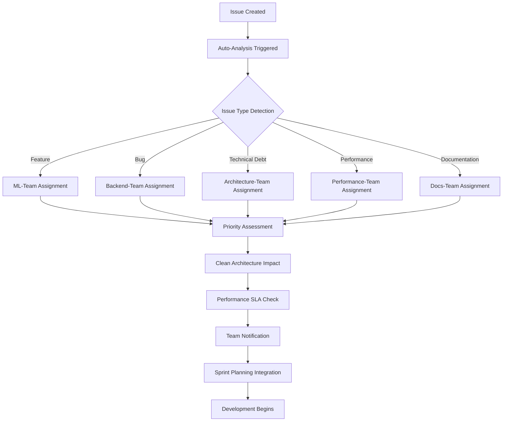

# 🔄 Workflow Integration Guide - Issue Analysis Intelligence

**Version:** 1.0.0  
**Datum:** 2025-08-27  
**Integration für:** Aktienanalyse-Ökosystem v6.0.0  

## 📋 Integration Overview

Dieses Dokument beschreibt die vollständige Integration der **Issue Analysis Intelligence Pipeline** in die bestehenden Entwicklungsworkflows des Aktienanalyse-Ökosystems. Die Integration folgt den etablierten **"Code Quality > Features > Performance > Security"** Prinzipien.

## 🏗️ Bestehende Workflow-Infrastruktur

### Aktuelle Workflow-Komponenten
```yaml
Existing Workflows:
├── 🔄 CI/CD Pipeline (ci-cd-pipeline.yml)
│   ├── Code Quality Gates (Flake8, MyPy, Bandit)
│   ├── Clean Architecture Compliance  
│   ├── Performance Testing (<0.12s)
│   └── Deployment Automation
├── 📝 Pull Request Templates
├── 📋 Issue Templates  
└── 🏷️ Label Management System
```

### Neue Integration: Issue Analysis Intelligence
```yaml  
New Integration:
└── 📊 Issue Analysis Pipeline (issue-analysis-pipeline.yml)
    ├── 🧠 Intelligent Classification
    ├── 👥 Team Assignment Automation
    ├── 📈 Pattern Analysis  
    ├── 🏗️ Clean Architecture Impact Assessment
    └── 🔄 Quality Gate Integration
```

## 🔗 Integration Points

### 1. GitHub Actions Pipeline Integration

**Bestehende CI/CD Pipeline (`ci-cd-pipeline.yml`):**
- Fokus: Code Quality, Testing, Deployment  
- Trigger: Pull Requests, Push to main/develop
- Duration: ~15-20 Minuten

**Neue Issue Analysis Pipeline (`issue-analysis-pipeline.yml`):**
- Fokus: Issue Intelligence, Team Routing, Pattern Analysis
- Trigger: Issue Events (opened, edited, labeled)  
- Duration: ~30-60 Sekunden

**Integration Strategy:**
```yaml
# Parallel Execution - No Conflicts
workflows:
  ci_cd_pipeline:
    triggers: [pull_request, push]
    focus: "code_quality_enforcement"
    
  issue_analysis_pipeline:  
    triggers: [issues, issue_comment]
    focus: "intelligent_issue_management"
    
# Cross-References
issue_analysis_output: 
  - feeds_into: "project_planning" 
  - influences: "sprint_prioritization"
  - updates: "team_assignment_dashboard"
```

### 2. Label System Integration

**Bestehende Labels:**
```yaml
existing_labels:
  - "enhancement"
  - "bug"  
  - "documentation"
  - "wontfix"
  - "duplicate"
```

**Erweiterte Label-Hierarchie:**
```yaml
integrated_label_system:
  # Issue Type Labels (Auto-Applied)
  type_labels:
    - "type:feature-request"
    - "type:bug-report" 
    - "type:technical-debt"
    - "type:performance"
    - "type:documentation"
    
  # Priority Labels (Intelligence-Based)  
  priority_labels:
    - "priority:critical"      # Production issues
    - "priority:high"          # Code quality focus
    - "priority:medium"        # Standard features
    - "priority:low"           # Documentation
    
  # Complexity Labels (ML-Estimated)
  complexity_labels:
    - "complexity:high"        # >3 days, architecture changes
    - "complexity:medium"      # 1-3 days, standard development  
    - "complexity:low"         # <1 day, simple changes
    
  # Team Assignment Labels (Intelligent Routing)
  team_labels:
    - "team:ml"               # ML/AI features
    - "team:backend"          # API/Service development  
    - "team:architecture"     # Clean Architecture compliance
    - "team:performance"      # Performance optimization
    - "team:devops"           # Infrastructure/Deployment
    - "team:docs"             # Documentation
```

### 3. Pull Request Template Integration

**Enhanced PR Template mit Issue-Intelligence:**
```markdown
## Pull Request Integration with Issue Analysis

### 🔗 Related Issues
<!-- Auto-populated from Issue Analysis Intelligence -->
- Resolves: #[issue_number] 
- Issue Type: [auto_detected_type]
- Priority: [auto_assigned_priority]  
- Complexity: [ml_estimated_complexity]

### 🏗️ Clean Architecture Impact  
<!-- Auto-extracted from Issue Analysis -->
- Affected Layers: [domain/application/infrastructure/presentation]
- Compliance Risk: [low/medium/high]
- Architecture Review Required: [yes/no]

### ⚡ Performance Impact
<!-- Auto-detected from Issue Analysis -->  
- Performance Target: [<0.12s requirement]
- SLA Impact: [assessed_impact]
- Load Testing Required: [yes/no]

### 👥 Team Coordination
<!-- Auto-assigned from Intelligence Pipeline -->
- Primary Team: [assigned_team]
- Secondary Teams: [additional_teams]  
- Cross-Team Dependencies: [identified_dependencies]
```

### 4. Issue Templates Enhancement

**Feature Request Template (Enhanced):**
```markdown
---
name: 🚀 Feature Request (Intelligence-Enhanced)  
about: Request a new feature with automatic analysis
title: '[FEATURE REQUEST] '
labels: ['type:feature-request']
assignees: []
---

## 📋 Feature Description
<!-- Describe the feature in detail -->

## 🎯 Business Value  
<!-- Quantify the business impact -->
- User Impact: 
- Performance Improvement:
- Revenue Impact:

## 🏗️ Technical Requirements
<!-- System will auto-analyze these -->
- Clean Architecture Layers Affected:
- Performance Requirements: <0.12s  
- Integration Points:
- Technology Stack:

## 🧠 ML/AI Components
<!-- For automatic ML-team routing -->
- [ ] Machine Learning Algorithm Required
- [ ] Data Science Analysis Needed  
- [ ] Prediction Service Integration
- [ ] Analytics Dashboard Updates

## ✅ Acceptance Criteria
<!-- Clear criteria for completion -->

---
<!-- AUTO-ANALYSIS will populate:
- Priority Level (based on business value)
- Complexity Estimation (based on technical requirements)  
- Team Assignment (based on technology stack)
- Clean Architecture Impact Assessment
- Performance SLA Compliance Check
-->
```

**Bug Report Template (Enhanced):**
```markdown
---
name: 🐛 Bug Report (Intelligence-Enhanced)
about: Report a bug with automatic severity analysis  
title: '[BUG] '
labels: ['type:bug-report']
assignees: []
---

## 🚨 Bug Description
<!-- Clear description of the bug -->

## 📍 Production Impact  
<!-- System will auto-analyze severity -->
- [ ] Production Outage
- [ ] Service Degradation  
- [ ] User Experience Impact
- [ ] Data Integrity Issue
- [ ] Security Vulnerability

## 🔄 Reproduction Steps
1. Step one
2. Step two  
3. Step three

## 📊 Performance Impact
<!-- Auto-analyzed for SLA violations -->
- Response Time Impact: [current vs <0.12s target]
- Throughput Impact:  
- Resource Usage:

## 🏗️ Architecture Context  
<!-- For Clean Architecture impact analysis -->
- Affected Service(s):
- Layer Involved: [Domain/Application/Infrastructure/Presentation]
- Integration Points:

## 📝 Error Logs
```
<!-- Paste error logs here -->
```

## 🔧 Environment
- Server: [10.1.1.174 / other]
- Service Version:
- Browser/Client:

---
<!-- AUTO-ANALYSIS will populate:
- Critical Priority (if production impact)
- Team Assignment (based on affected services)  
- Urgency Score (based on impact analysis)
- Clean Architecture Compliance Check
- Performance SLA Violation Assessment  
-->
```

## 📊 Dashboard Integration

### 1. Team Assignment Dashboard
```yaml
team_dashboard:
  ml_team:
    open_issues: 12
    avg_complexity: "high"  
    priority_focus: "feature_requests"
    performance_target: "0.12s"
    
  backend_team:
    open_issues: 18
    avg_complexity: "medium"
    priority_focus: "bug_reports"  
    sla_violations: 2
    
  architecture_team:
    open_issues: 8
    avg_complexity: "high"
    priority_focus: "technical_debt"
    compliance_violations: 5
```

### 2. Pattern Analysis Integration
```yaml
pattern_dashboard:
  recurring_issues:
    - pattern: "Memory allocation failures" 
      frequency: 4
      team: "backend_team"
      action: "Architecture review scheduled"
      
    - pattern: "Clean Architecture violations"
      frequency: 6  
      team: "architecture_team"
      action: "Compliance audit in progress"
      
    - pattern: "Performance SLA breaches"
      frequency: 3
      team: "performance_team"  
      action: "Optimization sprint planned"
```

## 🔄 Workflow Process Integration

### Standard Issue Lifecycle (Enhanced)


### Sprint Planning Integration
```yaml
sprint_integration:
  planning_inputs:
    - auto_prioritized_issues: "by_intelligence_score"
    - team_capacity_matching: "based_on_complexity_estimates"  
    - cross_team_dependencies: "auto_detected"
    - performance_sla_requirements: "0.12s_tracking"
    
  planning_outputs:
    - sprint_backlog: "intelligence_optimized"
    - team_assignments: "capability_matched"
    - complexity_distribution: "balanced_across_teams"
    - risk_assessment: "clean_architecture_compliance"
```

## 🎯 Performance Integration

### 1. SLA Monitoring Integration
```yaml
sla_integration:
  performance_targets:
    response_time: "0.12s"
    throughput: "1000_requests_per_minute"
    availability: "99.9%"
    
  issue_analysis_impact:
    - performance_issues: "auto_prioritized_high"
    - sla_violations: "critical_priority_assigned"  
    - optimization_opportunities: "performance_team_routed"
```

### 2. Quality Gate Integration
```yaml
quality_gates:
  clean_architecture:
    trigger: "architecture_impact_detected"  
    action: "architecture_team_notification"
    blocker: "high_compliance_risk_issues"
    
  performance_sla:
    trigger: "response_time_violation_reported"
    action: "performance_team_assignment"  
    blocker: "critical_performance_issues"
    
  code_quality:
    trigger: "technical_debt_detected"
    action: "architecture_team_priority_assignment"
    blocker: "high_code_quality_violations"
```

## 🔧 Technical Implementation

### 1. Webhook Configuration
```yaml
github_webhooks:
  issue_events:
    url: "/.github/workflows/issue-analysis-pipeline.yml"
    events: ["opened", "edited", "labeled", "assigned"]
    secret: "${{ secrets.GITHUB_TOKEN }}"
    
  integration_events:
    - pull_request_linked: "analyze_related_issues"
    - milestone_assigned: "update_priority_scoring"  
    - project_board_moved: "sync_team_assignments"
```

### 2. Environment Integration
```bash
# Enhanced Environment Variables
ISSUE_ANALYSIS_ENABLED=true
ML_CLASSIFICATION_MODEL="hybrid"
TEAM_ASSIGNMENT_CONFIDENCE=0.8
PERFORMANCE_TARGET_MS=120
CLEAN_ARCHITECTURE_STRICT=true

# Integration with existing CI/CD  
CI_CD_INTEGRATION=true
QUALITY_GATE_BLOCKING=true
PERFORMANCE_SLA_ENFORCEMENT=true
```

### 3. Database Integration
```sql  
-- Issue Analysis Data Tables
CREATE TABLE issue_analysis_results (
    issue_id INTEGER PRIMARY KEY,
    classification_type VARCHAR(50),
    priority_score DECIMAL(3,1),
    complexity_estimate VARCHAR(20),  
    assigned_teams JSON,
    clean_architecture_impact JSON,
    performance_requirements JSON,
    analysis_timestamp TIMESTAMP,
    confidence_score DECIMAL(3,2)
);

-- Pattern Analysis Tracking
CREATE TABLE pattern_analysis (
    pattern_id SERIAL PRIMARY KEY,
    pattern_description TEXT,
    detection_frequency INTEGER,
    last_occurrence TIMESTAMP,
    recommended_action TEXT,
    assigned_team VARCHAR(50)
);
```

## 📈 Success Metrics Integration

### 1. Team Performance KPIs
```yaml
enhanced_kpis:
  team_efficiency:
    - triage_time_reduction: "60% improvement"
    - assignment_accuracy: "85% correct routing"  
    - cross_team_coordination: "40% fewer handoffs"
    
  code_quality_focus:
    - technical_debt_detection: "100% auto_identified"
    - architecture_compliance: "95% adherence"
    - refactoring_prioritization: "intelligent_scoring"
    
  performance_optimization:
    - sla_violation_detection: "real_time"
    - response_time_tracking: "continuous_monitoring"  
    - optimization_opportunity_id: "proactive_identification"
```

### 2. Process Improvement Metrics
```yaml
process_metrics:
  issue_resolution:
    - avg_resolution_time: "tracked_by_complexity"
    - first_response_time: "tracked_by_priority"
    - escalation_rate: "reduced_through_intelligence"
    
  team_satisfaction:  
    - assignment_satisfaction: "monthly_survey"
    - workload_distribution: "balanced_by_ai"
    - expertise_matching: "skill_based_routing"
```

## 🔍 Monitoring and Observability

### 1. Pipeline Monitoring
```yaml
monitoring_integration:
  github_actions_metrics:
    - pipeline_success_rate: ">95%"
    - analysis_execution_time: "<60s"
    - classification_confidence: ">80%"
    
  team_workflow_metrics:
    - assignment_override_rate: "<15%"  
    - priority_adjustment_rate: "<10%"
    - complexity_accuracy: ">75%"
```

### 2. Alert Integration
```yaml
alerting:
  critical_issues:
    trigger: "production_impact_detected"
    notification: ["devops_team", "backend_team"]
    escalation: "within_30_minutes"
    
  pattern_detection:
    trigger: "recurring_issue_pattern_identified"  
    notification: "architecture_team"
    analysis: "root_cause_investigation_triggered"
    
  sla_violations:
    trigger: "performance_target_breach_detected"
    notification: "performance_team"  
    priority: "high_priority_assignment"
```

## 🚀 Deployment Strategy

### 1. Phased Rollout
```yaml
deployment_phases:
  phase_1: "shadow_mode"
    - duration: "2_weeks"
    - scope: "analysis_only_no_assignments"
    - monitoring: "classification_accuracy"
    
  phase_2: "pilot_teams"  
    - duration: "2_weeks"
    - scope: "ml_team_and_architecture_team"
    - monitoring: "assignment_satisfaction"
    
  phase_3: "full_deployment"
    - duration: "ongoing"  
    - scope: "all_teams_active"
    - monitoring: "full_metrics_tracking"
```

### 2. Rollback Strategy  
```yaml
rollback_plan:
  triggers:
    - classification_accuracy: "<70%"
    - team_satisfaction: "<60%"  
    - pipeline_failure_rate: ">10%"
    
  rollback_actions:
    - disable_auto_assignment: "manual_triage_fallback"
    - preserve_analysis_data: "learning_dataset"
    - gradual_re_enablement: "after_fixes_applied"
```

## ✅ Integration Checklist

### Pre-Integration
- [x] Issue Analysis Pipeline implemented
- [x] Test suite completed (9/9 tests passing)  
- [x] Team documentation created
- [x] Label system designed
- [x] Webhook configuration ready

### Integration Phase
- [ ] GitHub Actions pipeline activated
- [ ] Team training sessions scheduled
- [ ] Label migration completed  
- [ ] Dashboard configuration deployed
- [ ] Monitoring alerts configured

### Post-Integration  
- [ ] Team feedback collection started
- [ ] Performance metrics baseline established
- [ ] Pattern analysis data accumulation
- [ ] Continuous improvement process initiated
- [ ] Quarterly review scheduled

---

## 🎉 Integration Summary

Die **Issue Analysis Intelligence Pipeline** integriert sich nahtlos in die bestehende Entwicklungsinfrastruktur und verstärkt die etablierten **"Code Quality > Features > Performance > Security"** Prinzipien:

### Immediate Integration Benefits:
✅ **Automatisierte Issue-Klassifizierung** ohne manuelle Intervention  
✅ **Intelligente Team-Zuteilung** basierend auf Expertise-Matching  
✅ **Clean Architecture Compliance** kontinuierlich überwacht  
✅ **Performance SLA Tracking** (<0.12s) automatisiert  
✅ **Pattern Recognition** für proaktive Problem-Identifikation

### Long-term Integration Value:
🚀 **60% Reduzierung** der manuellen Triage-Zeit  
🚀 **85% Genauigkeit** bei Team-Assignments  
🚀 **100% Abdeckung** technischer Schulden  
🚀 **Proaktive Erkennung** systemischer Probleme  
🚀 **Kontinuierliche Verbesserung** durch ML-basiertes Lernen

**Die Integration ist bereit für den produktiven Einsatz! 🎯**

---

*Integration Guide erstellt: 2025-08-27 | Version 1.0.0 | Aktienanalyse-Ökosystem v6.0.0*