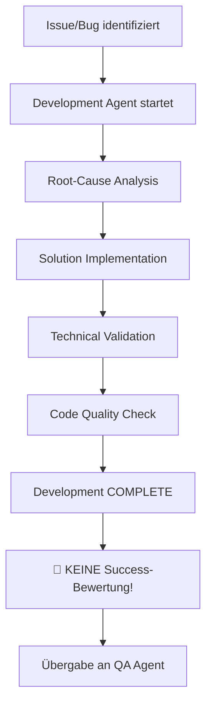
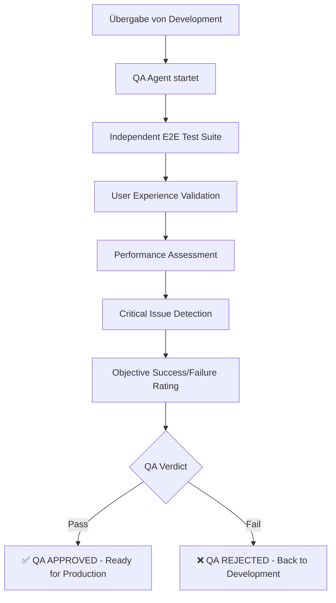

# 🔍 Workflow Quality Gate Protocol - Mandatory Agent Separation

**Version:** 1.0.0  
**Datum:** 2025-08-27  
**Geltungsbereich:** Alle zukünftigen Entwicklungs- und Bug-Fix-Workflows  

---

## 🚨 **KRITISCHE REGEL: AGENT SEPARATION MANDATORY**

> **"Ein Agent darf niemals seine eigene Arbeit als erfolgreich bewerten!"**

### Grund für diese Regel:
- **Development Bias:** Entwickelnde Agents neigen zu positiven Bewertungen ihrer eigenen Arbeit
- **False Success Reports:** Führt zu "Mission Accomplished" ohne echte Validierung
- **User Experience Ignorance:** Technische Implementierung ≠ Funktionale User Experience
- **Quality Compromise:** Fehlende objektive Validierung kompromittiert Codequalität

---

## 🏗️ **MANDATORY WORKFLOW ARCHITECTURE**

### 1. **Development Agent** (Implementation Focus)
```yaml
responsibilities:
  - Code-Implementierung
  - Technische Problemlösung  
  - Bug-Fixes und Features
  - Architecture-Compliance
  
restrictions:
  - DARF NICHT eigene Arbeit als "erfolgreich" bewerten
  - DARF NICHT "Mission Accomplished" melden
  - DARF NICHT E2E User Experience beurteilen
  - MUSS Arbeit an QA Agent übergeben
```

### 2. **Quality Assurance Agent** (Validation Focus)
```yaml
responsibilities:
  - Unabhängige E2E Tests
  - User Experience Validierung
  - Objektive Success/Failure Assessment
  - Critical Issue Detection
  - Final Go/No-Go Entscheidung
  
restrictions:
  - DARF NICHT Code implementieren oder ändern
  - DARF NICHT Fixes entwickeln
  - IST vollständig unabhängig vom Development
  - FOKUS nur auf objektive Qualitätsbewertung
```

---

## 📋 **MANDATORY WORKFLOW PROCESS**

### Phase 1: Development (Development Agent)


### Phase 2: Quality Assurance (QA Agent)  


---

## 🛡️ **QUALITY GATES - MANDATORY CHECKPOINTS**

### Gate 1: Development Complete (Development Agent)
```yaml
required_deliverables:
  - ✅ Code implementation completed
  - ✅ Technical functionality verified  
  - ✅ Architecture compliance checked
  - ✅ Performance targets met (<0.12s)
  - ✅ Error handling implemented
  
forbidden_activities:
  - ❌ Success/Failure assessment
  - ❌ User experience evaluation
  - ❌ "Mission accomplished" declarations
  - ❌ Production deployment decisions
```

### Gate 2: Quality Assurance (QA Agent)
```yaml
required_validations:
  - 🔍 E2E User Experience Tests (100% pass required)
  - 🔍 All critical navigation paths functional
  - 🔍 Performance SLA compliance validated
  - 🔍 Integration testing completed
  - 🔍 Cross-browser compatibility verified
  
qa_exit_criteria:
  success_threshold: "100% critical tests pass"
  performance_sla: "<120ms average response time" 
  user_experience: "All navigation intuitive and functional"
  integration: "All backend services responding"
```

---

## 🎯 **IMPLEMENTATION EXAMPLES**

### ✅ **CORRECT Workflow:**
```python
# Development Agent
development_agent = FrontendFixAgent()
fix_result = development_agent.implement_navigation_fix()

# CRITICAL: NO success assessment by development agent
if fix_result.code_complete:
    print("🔧 Development phase complete - handing over to QA")
    
    # Separate QA Agent
    qa_agent = IndependentQualityAssuranceAgent()  
    qa_result = qa_agent.execute_complete_qa_audit()
    
    # ONLY QA Agent determines success/failure
    if qa_result.qa_verdict == "QA_APPROVED":
        print("✅ QA APPROVED - Ready for production")
    else:
        print("❌ QA REJECTED - Fixes required")
```

### ❌ **INCORRECT Workflow (FORBIDDEN):**
```python
# Development Agent
development_agent = FrontendFixAgent()
fix_result = development_agent.implement_navigation_fix()

# FORBIDDEN: Development agent assessing own work
if fix_result.code_complete:
    print("✅ Mission Accomplished - Navigation fixed!")  # ← FORBIDDEN
    print("🎉 Ready for production!")  # ← FORBIDDEN
```

---

## 📊 **QA AGENT SPECIFICATIONS**

### Minimum QA Test Suite Requirements:
```yaml
mandatory_tests:
  user_experience_tests:
    - homepage_navigation_menu_presence
    - all_navigation_links_clickable
    - navigation_menu_visual_correct
    
  functional_tests:
    - dashboard_navigation_redirect
    - ki_vorhersage_navigation_redirect  
    - soll_ist_vergleich_navigation_redirect
    - depot_navigation_direct_load
    
  integration_tests:
    - complete_user_journey_dashboard
    - complete_user_journey_ki_vorhersage
    - complete_user_journey_soll_ist
    - complete_user_journey_depot
    
  performance_tests:
    - response_time_under_sla
    - concurrent_user_simulation
    - load_testing_navigation
```

### QA Success Criteria:
```yaml
critical_requirements:
  - test_pass_rate: "100%"
  - critical_failures: "0"
  - user_experience_rating: "GOOD or EXCELLENT"
  - performance_sla_compliance: "true"
  - integration_success: "true"
```

---

## 🔄 **CONTINUOUS IMPROVEMENT PROTOCOL**

### 1. QA Feedback Loop:
```yaml
when_qa_fails:
  - QA Agent provides detailed failure analysis
  - Development Agent fixes specific issues
  - NO assumptions about success
  - Process repeats until QA approval
```

### 2. QA Metrics Tracking:
```yaml
track_metrics:
  - qa_approval_rate_per_developer
  - average_qa_cycles_per_feature
  - critical_failure_detection_rate
  - user_experience_rating_trends
```

### 3. Process Refinement:
```yaml
monthly_review:
  - QA Agent effectiveness analysis
  - Development-QA handover optimization
  - Test suite enhancement based on findings
  - False positive/negative rate assessment
```

---

## 📋 **AGENT TRAINING REQUIREMENTS**

### Development Agents:
```yaml
must_understand:
  - "Development ≠ Quality Assurance"
  - "Code Complete ≠ User Ready"
  - "Technical Working ≠ User Experience Working"
  - "Never assess own work success"
  
training_focus:
  - SOLID principles implementation
  - Clean Architecture adherence
  - Performance optimization
  - Error handling mastery
```

### QA Agents:
```yaml
must_understand:
  - "User perspective first"
  - "Objective validation only"
  - "No development bias allowed"
  - "Critical issue detection priority"
  
training_focus:
  - E2E test design
  - User experience assessment
  - Performance analysis
  - Integration testing methodology
```

---

## 🎉 **SUCCESS METRICS**

### Development Quality Improvement:
- **Reduced False Success Reports:** Target 0% false positives
- **Increased First-Pass QA Rate:** Target >80% QA approval on first attempt
- **Improved User Experience:** Target 100% "GOOD" or "EXCELLENT" ratings
- **Faster Issue Resolution:** Clear separation reduces debugging cycles

### Process Excellence:
- **Clear Accountability:** Development vs QA responsibilities defined
- **Objective Decision Making:** QA Agent removes bias from success assessment
- **Continuous Learning:** QA feedback improves development quality
- **User-Focused Delivery:** Every feature validated from user perspective

---

## 🚨 **ENFORCEMENT MEASURES**

### Mandatory Compliance:
```yaml
all_workflows_must:
  - Use separate Development and QA agents
  - Forbid self-assessment of success
  - Require QA approval for production deployment
  - Document QA results for audit trail
```

### Violation Consequences:
```yaml
if_violated:
  - Workflow must be restarted with proper separation
  - All success claims invalidated until QA validation
  - Process audit and improvement required
  - Documentation of lessons learned mandatory
```

---

**Diese Quality Gate Protocol ist ab sofort MANDATORY für alle Entwicklungs-Workflows!**

*🤖 Generated with [Claude Code](https://claude.ai/code) - Quality Assurance Excellence*